# Expo visual refresh screenshots

These are browser renders of the final Expo export with deterministic test accounts and food/weight
fixtures. They are not design mocks or physical-device screenshots. The regression images were
verified against the final export before copying; the interaction captures were regenerated for this PR.

## Main pages

| Today, open - 390px | Today, completed - 390px | Progress - 390px |
| --- | --- | --- |
| 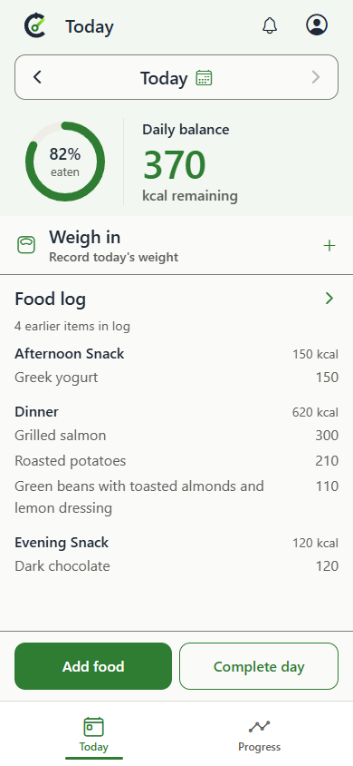 | 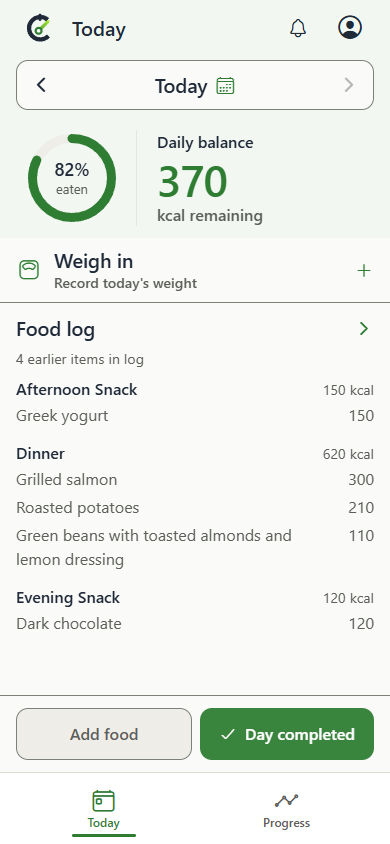 | 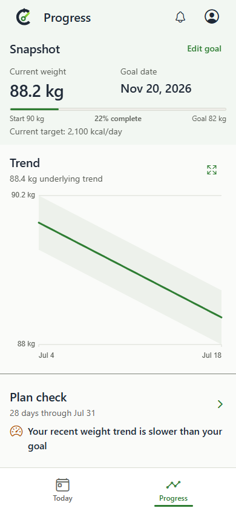 |

| Small phone - 320x568 | Completed day, dark - 390px | Progress, dark - 390px |
| --- | --- | --- |
| 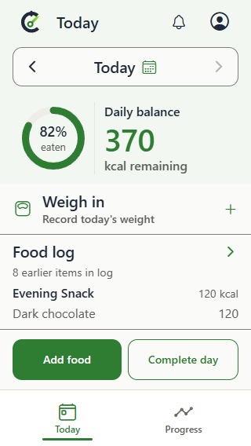 | 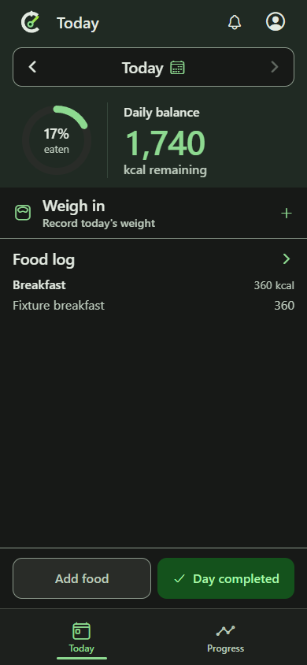 | 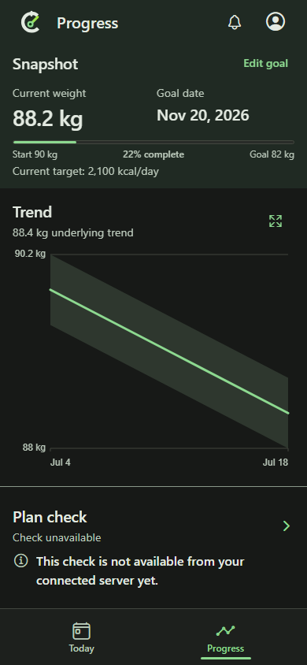 |

| Single Trend hover target - 390px | Desktop - 1440px |
| --- | --- |
| 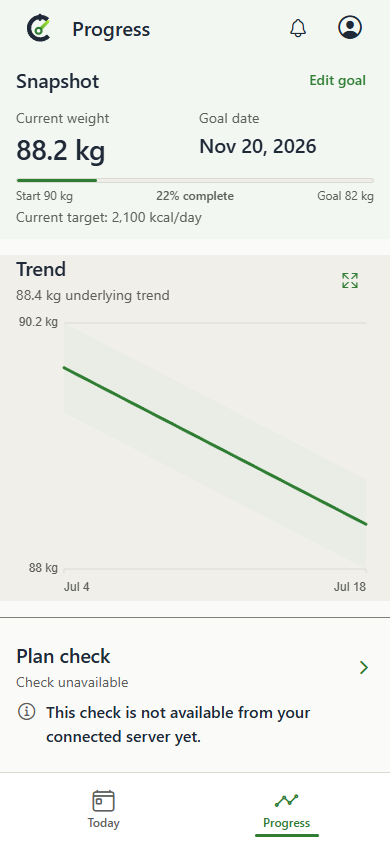 | 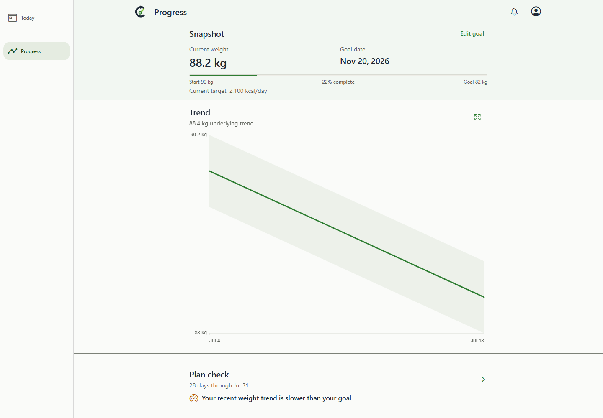 |

## Supporting flows

| Settings | Saved foods | Search |
| --- | --- | --- |
| 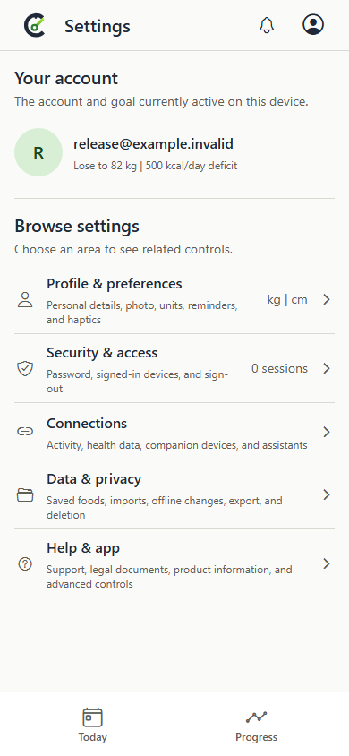 | 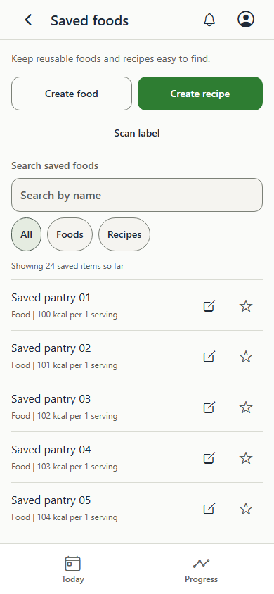 | 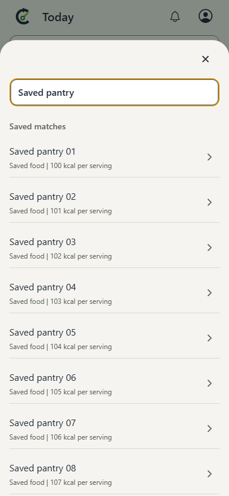 |

| Amount confirmation | Recipe ingredients and totals, scrolled | Onboarding |
| --- | --- | --- |
| 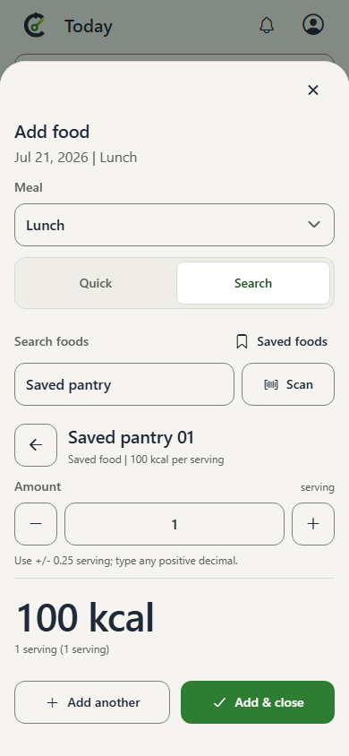 | 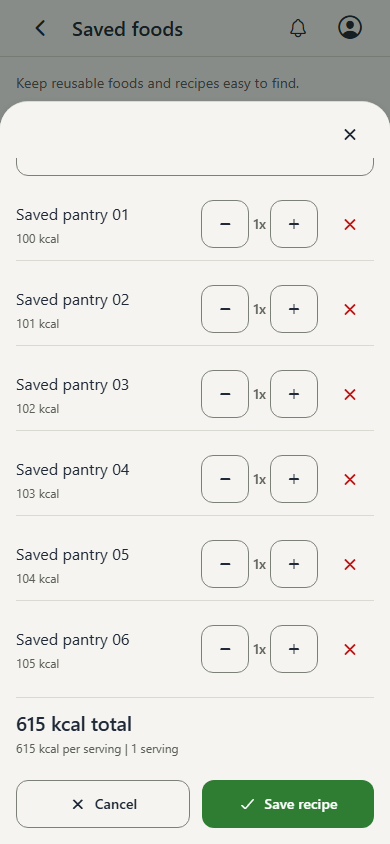 | 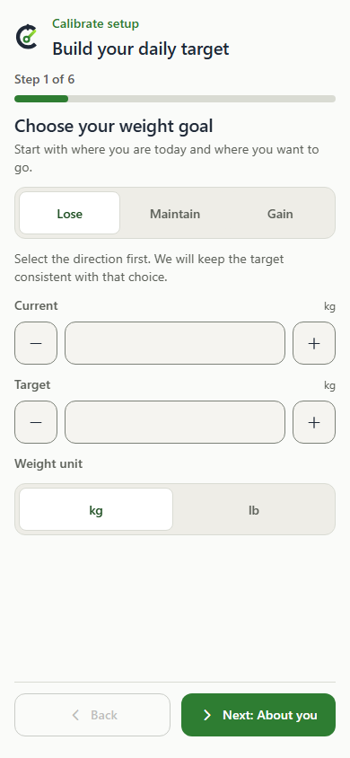 |

## Reproduction

- `fixed-page-layout.spec.ts`: Today open, completed, and minimum-height phone captures.
- `page-refinements.spec.ts`: completed-day dark appearance.
- `progress-fixed-layout.spec.ts`: Progress with a diagnosis and unified Trend hover.
- `launch-22-visual.spec.ts`: dark Progress and supporting-flow regression images.

The first three specs run through `node scripts/expo-web-playwright.mjs`; the final spec runs through
`npm run test:ux`. The PR's release export passed all 239 applicable UX gates and 61 applicable
fixed-page/interaction checks. These captures are browser evidence; physical-device behavior remains
unverified.
