# Expansion navigation evidence

Actual browser renders of the Expo web release export, captured with deterministic food, weight,
and Plan check fixtures. These images show the implementation in this PR; they are not design mocks
or physical-device screenshots. The screenshot run passed all 11 applicable expansion checks across
four viewports, with nine intentional project skips.

## Phone overview and expanded pages - 390x844

| Today overview | Food log expanded below the date picker |
| --- | --- |
| 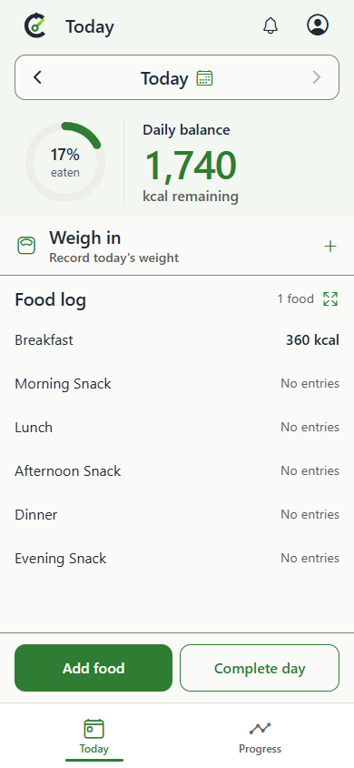 | 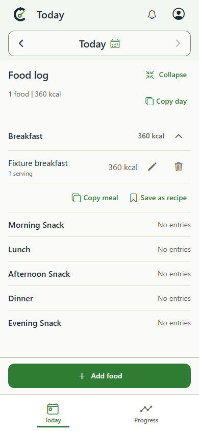 |

| Progress overview | Trend expanded | Plan check expanded |
| --- | --- | --- |
| 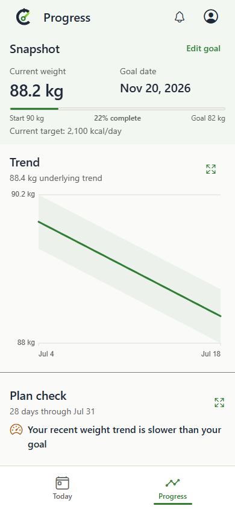 | 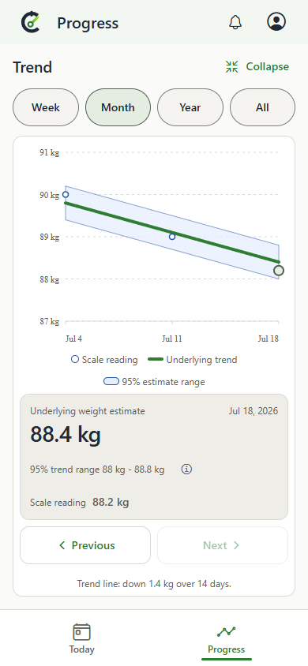 | 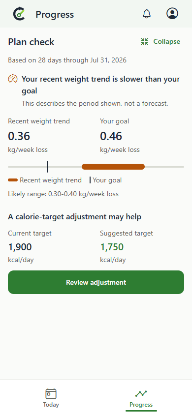 |

## Desktop - 1440x1000

The expanded content keeps the app bar, navigation rail, and centered reading column.

| Food log | Trend | Plan check |
| --- | --- | --- |
| 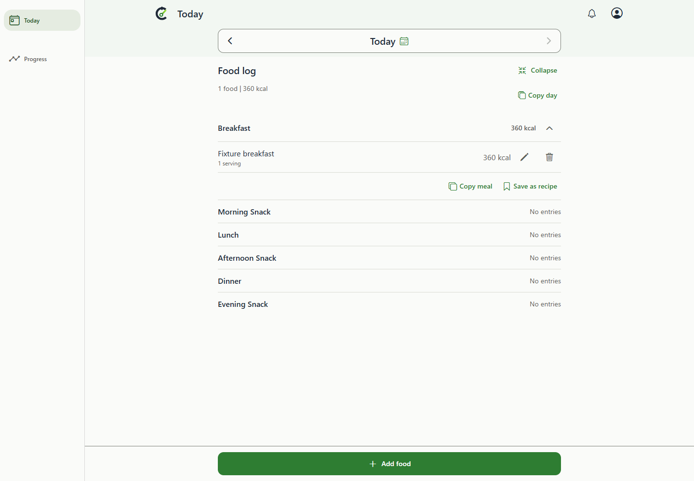 | 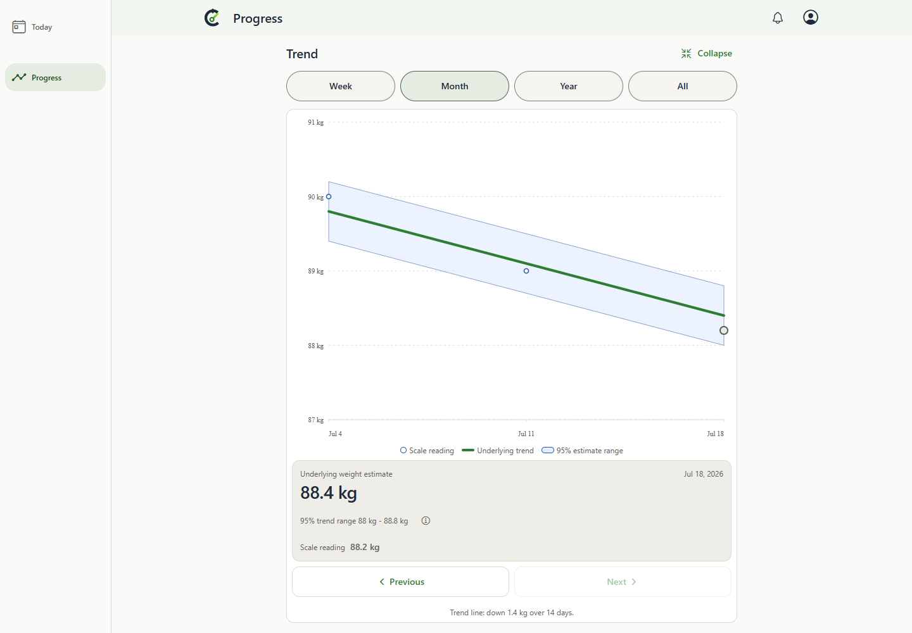 | 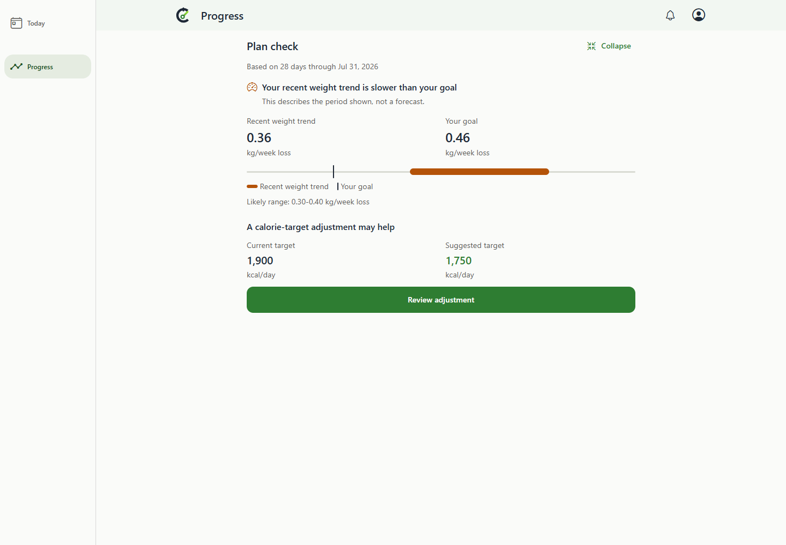 |

## Short phone and enlarged text - 320x568

The ordinary short-screen Trend keeps its complete plot and axes; reading details continue below
in the pane's scroll area. The dark 200% text captures show scrolled content with Collapse and
essential actions still reachable. Screenshot cropping at the pane edge represents scrollable
continuation, not removed content.

| Complete short-screen Trend | Food log, 200% text | Trend, 200% text | Plan check, 200% text |
| --- | --- | --- | --- |
| 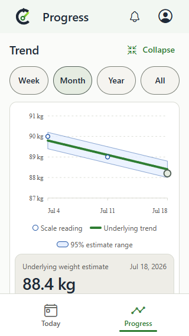 | 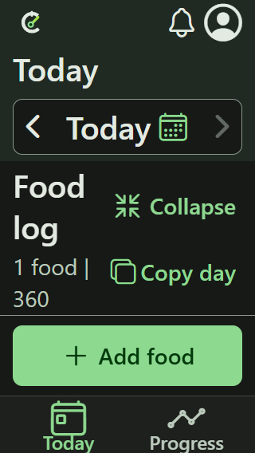 | 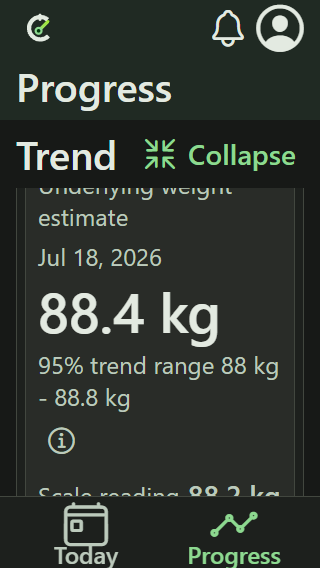 | 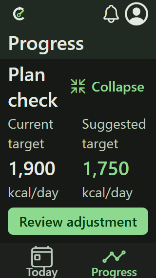 |

## Behavior and reproduction

`e2e/expo-web/page-expansion.spec.ts` captures these images and verifies pane bounds, the retained
date toolbar, keyboard focus and scroll restoration, browser history, nested Add food dismissal,
resizing, 200% text, and accessibility. Its motion test samples actual animation frames in both
directions and checks that the pane grows while the sections above and below move away.
The screenshots themselves show settled states.

```powershell
npm.cmd run test:web:e2e -- e2e/expo-web/page-expansion.spec.ts
```

Broader validation passed: Expo type-check and web export, 956 mobile tests, 16 web release checks,
239 normal UX checks, and the final 19-check expansion/history regression run. The designer
reviewed the final geometry and source/detail crossfade. Native-device animation, screen readers,
software keyboards, and insets remain unverified. See the [design review](../../../docs/design-review.md).
