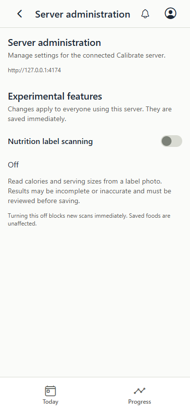
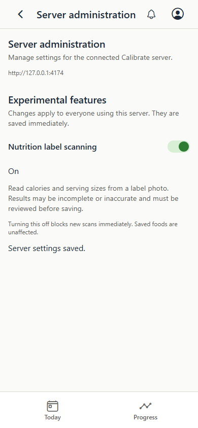
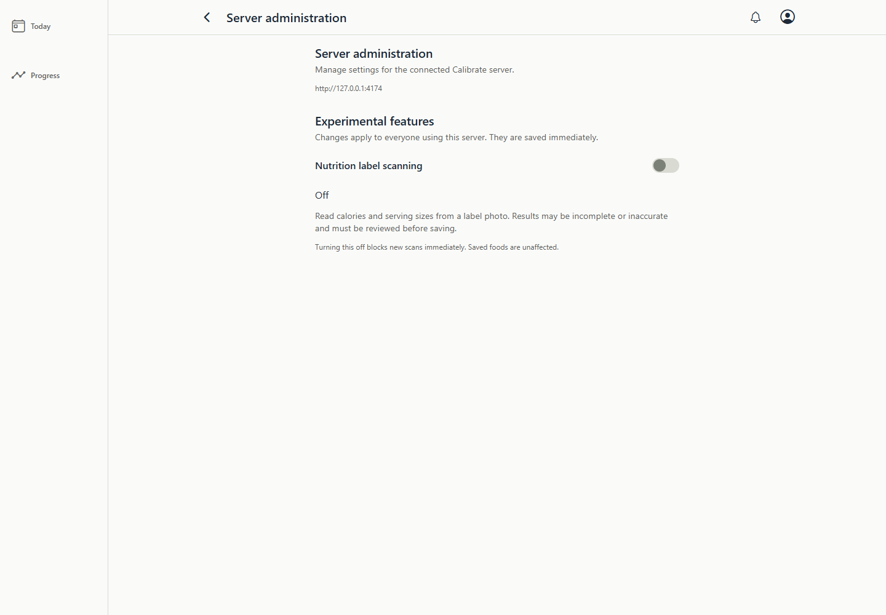
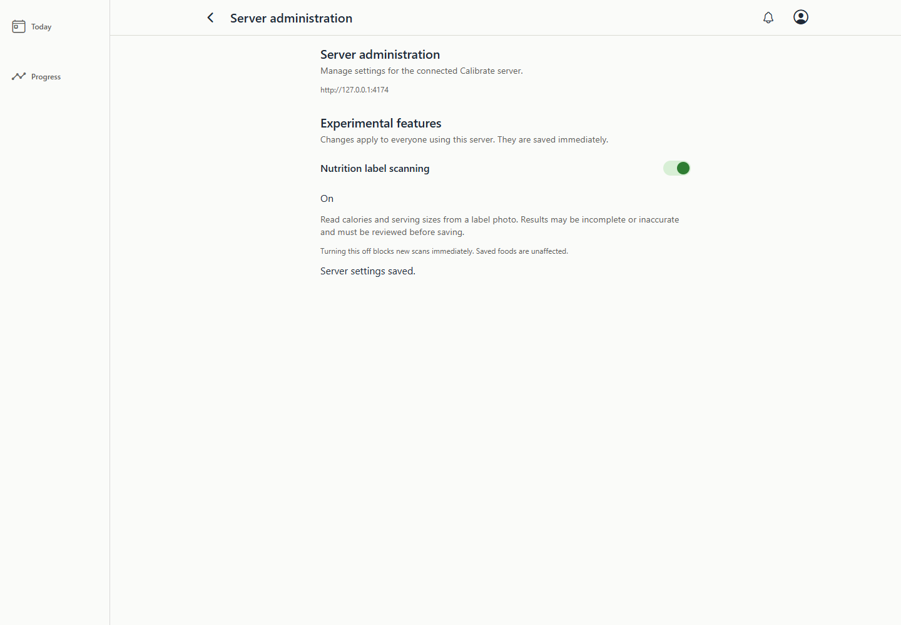

# Server administration screenshots

These are actual browser renders of the Expo web export with deterministic test data,
captured by `e2e/expo-web/server-admin.spec.ts`. The phone views use a 390px browser
viewport; they are not native-device screenshots. Desktop views use a 1440px viewport.

The default-off switch is shown beside its enabled state after a successful save.
The backend checks the current switch for every new scan request. Clients refresh
on screen mount, foreground/focus, and reconnect, without periodic polling.

| Viewport | Scanning disabled (default) | Scanning enabled |
| --- | --- | --- |
| Phone browser |  |  |
| Desktop browser |  |  |

Reproduce with:

```powershell
npm.cmd run test:web:e2e -- --project=desktop-chrome --project=android-phone-chrome e2e/expo-web/server-admin.spec.ts
```

Captures are written to `.codex-screenshots/server-admin/` before review and copying here.
