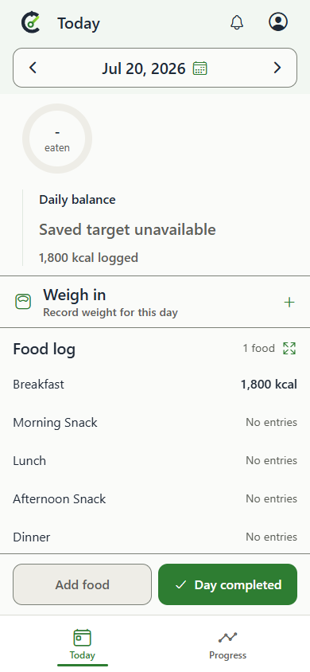
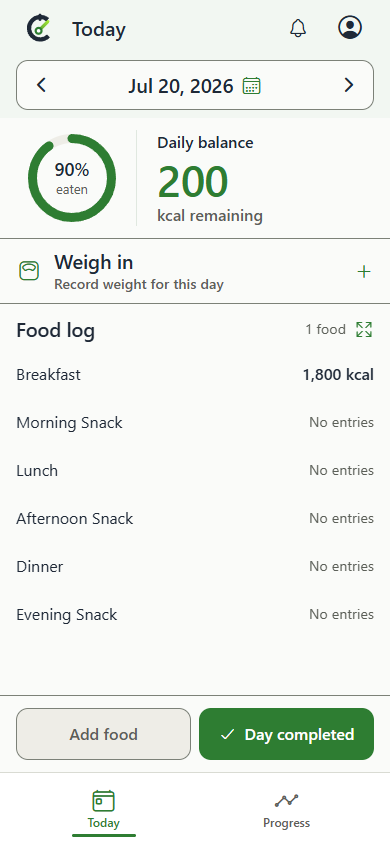

# Issue 435 — retained behavior and validation evidence

Owner: issue435 implementation task `01a1128c-d211-7497-8dbe-3acf0662f004`. Purpose: review and reproduce the saved-target fix. Retain this dedicated evidence ref and exact commit for the PR/review lifetime; never merge it into product history or silently replace assessed identities.

## Source and actual behavior

Before: `4cbcbc740fbe5fa5646b4de31951c79a653176d5`, actual target master checked before implementation and publication.
After: `3ac32ffa92f1e429dd689e2f52683bd8ea045d15`, one child commit, no unmerged parent.

Two independent checkouts installed dependencies via `node .codex/local-environment.setup.mjs` and built via `npm.cmd run build:expo-web`. Backend typecheck passed. The client source is unchanged between these revisions; independently built clients used the actual respective backend `getEffectiveFoodDay` function to generate intercepted responses. `serialize-fixture.cjs` loads source through the checkout's ts-node and stubs only database access; no live records, backend server or database are used. Its complete synthetic row and inputs are retained. Run from each checkout's backend directory:

```
node /path/to/serialize-fixture.cjs /path/to/before-responses.json
node /path/to/serialize-fixture.cjs /path/to/after-responses.json
```

For each run use the appropriate checkout/output, not both commands in one checkout. Before/After API outputs are retained verbatim. The valid fixture has 1800 intake, saved target 2000, maintenance 2500, July20 completion; the current profile target is 2100 in the existing UX fixture. Missing fixture has null snapshot fields. No current-target substitution or historical writes occur.

## Genuine matched UI captures

Windows Chrome 154.0.8037.98, browser viewport 390x844 (phone-sized browser, not physical Android). Both use light theme, en-US, America/Los_Angeles, reduced motion and the repository's frozen July21 clock. Route `/today?date=2026-07-20`; same synthetic food, selected date, account and view. Existing `hideTransientPwaNotices` normalization suppresses unrelated PWA lifecycle notices on both; no compared UI is modified. Screenshots are original full-page pixels, no cropping or redaction.

Serve each independent build via `node scripts/expo-web-static-server.mjs --port PORT` (Before47181 / After42307 in this run). Copy `capture.spec.ts` beside the checkout's existing `e2e/expo-web/fixtures.ts` as `saved-target-capture.spec.ts`, then set `CALIBRATE_EXPO_WEB_BASE_URL` to that loopback server, `SAVED_TARGET_EVIDENCE` to this evidence directory, and `SAVED_TARGET_SIDE` to before/after. Run:

```
npx.cmd playwright test --config playwright.expo-web.config.ts saved-target-capture.spec.ts --project android-phone-chrome --workers 1
```

Two cases passed for each side. Captures wait for intended balance text and fonts. Each capture JSON records full source, browser version, viewport, time and SHA256 of the response bytes for the served JS; the harness verifies those bytes match that checkout's build on disk. The repository fixture/config/build/static-server code is bound by the source commits; capture harness and serialization bridge are bound by manifest hashes. Builds completed before the After commit, with the same production tree; only maintained tests were subsequently added before committing. No production changes intervened.

Inspection: Before valid shows “Saved target unavailable”; After valid shows 90% eaten and 200 kcal remaining, consistent with 1800/2000. Missing remains unavailable on both. The three unavailable images are byte-identical independent captures (see hashes), not reused substitutes. No clipping in the changed balance area; unavailable layout's existing taller arrangement remains unchanged. All four originals were opened; the identical unavailable pixels establish the missing-state comparison. Actual GitHub-page rendering is waived under issue405comment6022754087; no claim that rendered-page verification ran. Independent QA pixel/provenance review remains required.

| Before: valid saved target | After: same valid target |
| --- | --- |
|  |  |

| Before: missing snapshot | After: missing snapshot |
| --- | --- |
|  |  |

## Executed checks and scope

- `node -r ts-node/register --test --test-concurrency=2` in backend: 764 tests passed, no skips/failures; full log retained.
- `npm.cmd --prefix backend run typecheck`: passed.
- `npm.cmd run build:expo-web`: passed independently on Before and After.
- `npm.cmd --prefix mobile test -- --runInBand src/food/dayPresentation.test.ts src/components/FoodTrackingStatus.test.tsx src/offline/foodDayReceipts.test.ts`: 53 tests passed, 3 suites; log retained.
- `npx.cmd playwright test --config playwright.expo-web.config.ts saved-target.spec.ts --project desktop-chrome --workers 1`, caller-owned loopback After server: 3 passed. Actual app completion changes current 2100 to saved 2000, reload retains it; historical null/omitted comparison stays unavailable. This maintained UI test uses synthetic API fixtures; backend contract tests separately exercise actual serializers.
- Matched capture tests: 4 passed across independent source builds.
- `git diff --check`: passed.

Full product range: one commit, eight paths, 136 additions/11 deletions. Four backend source files fix single-day read, phone and watch completion/sync responses through a validated read-only saved-comparison helper. Three backend test files cover service, HTTP route/refetch/sync, watch acknowledgement and unavailable boundaries. One maintained browser regression covers completion/reload and older payloads. No migrations, generated contracts, copied sources, capture harnesses or evidence files in product history. Optional existing wire field requires no schema change. No new client logic or release version changes.

Limitations: No live PostgreSQL/application server, physical-device or actual user OTA run. The exact deployed versions, platform and whether reported days have valid snapshots remain unknown; preserved original report is in issue435. Legacy missing snapshots deliberately remain unavailable. CI and external review status are reported on the live PR, not inferred from these local checks.
