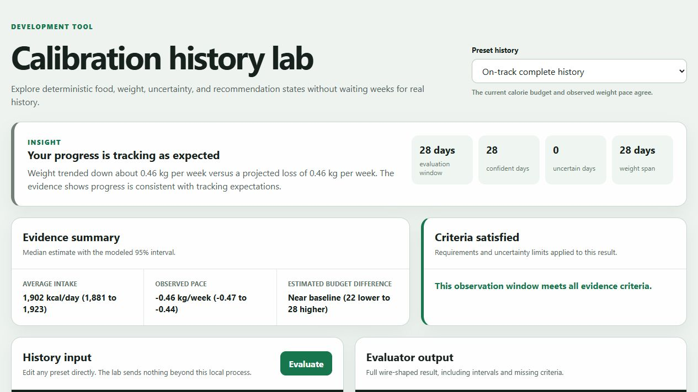
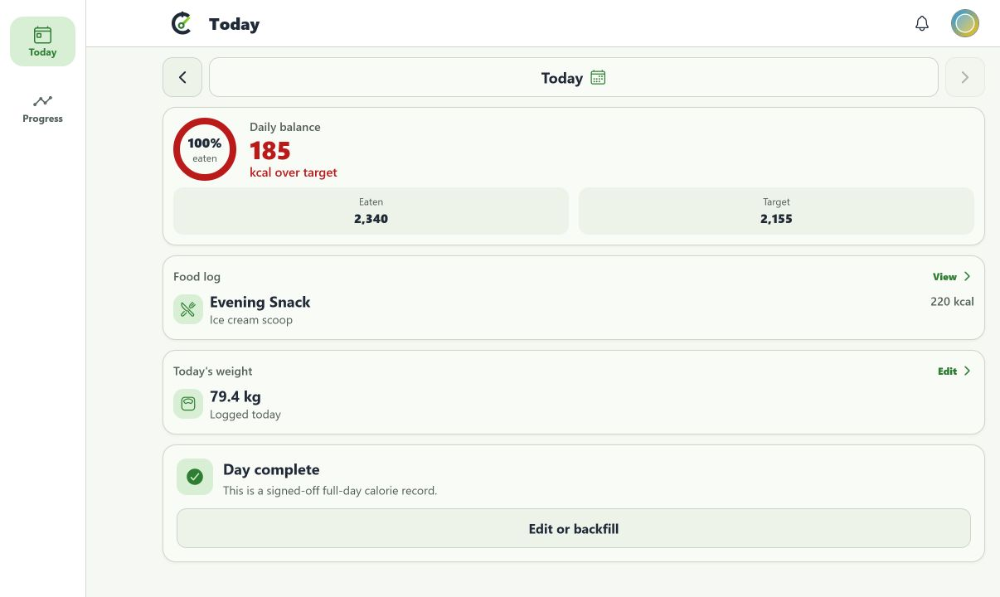
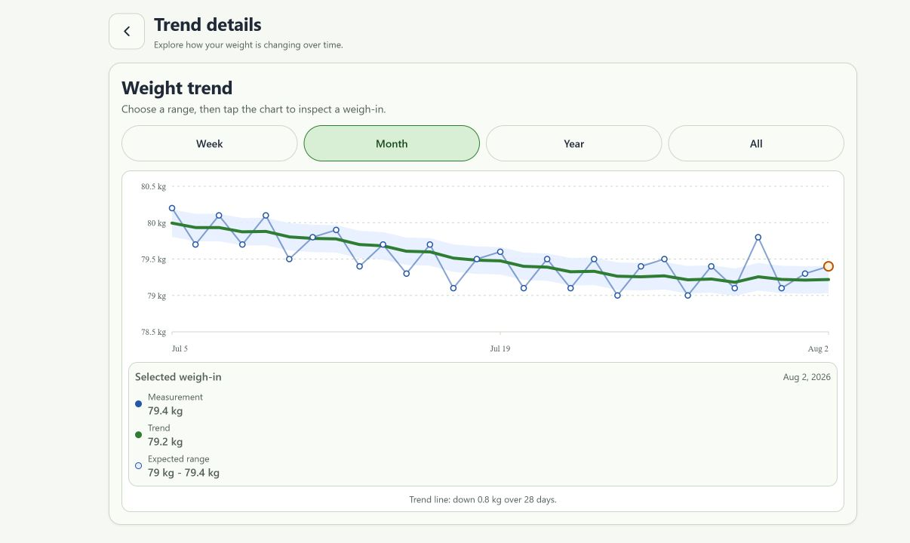

# Calibration insight manual QA

Tested on August 2, 2026 against the calibration history lab on PR #269.

## Scope and method

- Exercised all 14 shareable preset histories through the rendered development tool.
- Evaluated 7 additional edited histories for exact duration, weight-count, uncertainty, and age boundaries.
- Verified malformed JSON and structurally incomplete JSON remain in the lab with an actionable validation error.
- Inspected the rendered status, headline, evidence metrics, modeled intervals, target change, and gating criteria for each case.
- Ran a complementary 384-case deterministic invariant matrix across history length, age, pace, missing-day rate, weight uncertainty, and BMR floor position.
- Benchmarked 2,800 evaluations across the 14 presets: 2,081 ms total, or 0.74 ms per evaluation on this development machine.
- Repeated the rendered recommendation and uncertainty checks after rebasing onto the current mobile/day-status architecture and applying review feedback.
- Re-reviewed every preset at desktop and 390 px mobile widths after the final copy pass, including URL selection, optional-section visibility, metric wrapping, criteria language, and custom-input error recovery.
- Ran the full automated suites after the final preset pass: 427 backend tests, 368 mobile tests, 45 API-client tests, and 24 development-script tests.
- Built the production Expo web export and regenerated the Prisma and OpenAPI clients.

The lab invokes the same pure evaluator used by the service. An earlier seeded-product pass applied all migrations to an isolated local Postgres database and exercised recommendation materialization and approval through the real Expo web client. The final audit added direct service tests for materialization, revalidation, idempotent approval, scheduled-state suppression, exact resulting budgets, and next-local-day activation. A final live product rerun was attempted, but the local Docker engine did not become ready; the final scheduled-state copy and interaction changes were therefore verified through focused component tests rather than represented by stale screenshots.

## Result matrix

| History | Expected result | Observed result |
| --- | --- | --- |
| 6 complete days | `not_ready`, progress retained | Passed: 6 confident days and 6-day weight span are shown |
| 14 food days, 1 weight | `learning` | Passed: credits 14 well-tracked food days and asks specifically for more weight history |
| 7 complete days | Descriptive insight only | Passed: validates the observed -0.45 kg/week pace without implying a later adjustment is inevitable |
| 28 on-track days | Positive validation, no budget adjustment | Passed: observed and projected pace agree, and the conclusion is reassuring |
| Consistent slow loss | Decrease recommendation | Passed: shortest sufficient 14-day window, -150 kcal cap |
| Consistent fast loss | Increase recommendation | Passed: shortest sufficient 14-day window, +150 kcal cap |
| Prior 150 kcal budget decrease | Reverse prior decrease | Passed: the suggested budget returns directly from 1,750 to 1,900 kcal |
| Higher intake explains slow loss | Intake-matched insight | Passed: the conclusion compares 2,200 kcal logged with the 1,900 kcal budget and does not change the budget estimate |
| 7 missing and 4 suspicious days | Food-log uncertainty insight | Passed: all 11 days remain in the interval and the conclusion explains how to improve confidence |
| Broad weight confidence intervals | Weight-uncertainty insight | Passed: the plausible 0.04 to 0.43 kg/week loss range is explained and no budget is suggested |
| Activity data present | Observational context only | Passed: same calorie estimate as on-track history |
| Downward signal above BMR floor | Floor-limited decrease | Passed: suggested budget stops at the preset's 1,900 kcal BMR floor |
| Downward signal below BMR floor | No contradictory recommendation | Passed: downward evidence remains an insight with a floor explanation |
| 90 days supplied | 42-day cap | Passed: latest 42 days selected |
| 13 days with directional evidence | No early recommendation | Passed: explicitly requests 14 days |
| 2 weights spanning 14 days | Insight, no recommendation | Passed: explicitly requests a third weight |
| 1 missing day in 14 | Recommendation allowed if interval remains narrow | Passed: -150 kcal with singular uncertainty explanation |
| 1 suspicious day in 14 | Recommendation allowed if interval remains narrow | Passed: -150 kcal with singular uncertainty explanation |
| 10 incomplete days in 28 | No recommendation | Passed: uncertainty widens past directional confidence |
| All completed days suspicious | `learning` | Passed: asks for 7 plausible multi-meal days |
| Minor with otherwise actionable history | Insight only | Passed: adult-only criterion blocks recommendation |

## Issues found and addressed

1. **BMR floor could reverse recommendation direction.** A strong downward correction produced a positive target change when the current target was already below BMR. Downward changes are now blocked at or below the floor without fabricating an upward signal.
2. **Two weights could unlock a recommendation.** The action gate now requires at least three weights while still allowing a two-point descriptive pace.
3. **Pre-threshold progress appeared as zero.** Histories shorter than seven days now report their actual confident-day and weight-span progress.
4. **Weight pace was rounded too aggressively.** Weekly weight intervals now preserve three decimal places internally, producing accurate two-decimal user-facing pace text.
5. **Non-actionable criteria were hidden in the client.** The Progress card now lists what would improve an insight whenever no recommendation is available.
6. **Malformed structured JSON crashed the lab.** The editor now validates top-level and nested food, weight, and activity fields and preserves the last valid output on error.
7. **Single-day uncertainty copy had incorrect agreement.** Messages now use "looks/widens" for one day and "look/widen" for plural counts.
8. **The original lab depended on the retired Vite frontend workspace.** The lab now runs as a dependency-free local Node server against the compiled shared evaluator.
9. **The original six presets did not cover the full state space.** The lab now has 14 described, deep-linkable histories plus a clearly labeled custom-edit state and visual evidence summaries.
10. **The public result exposed a weight-derived expenditure estimate.** The evaluator now exposes only the bounded target correction; displayed calories out remains the profile-estimated TDEE.
11. **Accepted revisions could carry into a later goal.** Recommendations and plan revisions are now tied to their source goal, so a new maintenance or gain goal cannot inherit an older loss-goal adjustment.
12. **The feature migration collided with a migration added on `master`.** Calibration now uses migration `0031`, following the day-resolution migration at `0030`.
13. **The seeded account could not demonstrate calibration.** It now has 28 varied, explicitly completed food days aligned with the active goal plus 120 days of weight history, producing a conservative recommendation through the production service path.
14. **The web target-review sheet was offscreen after scrolling.** The sheet now stays fixed to the visual viewport, restoring visible and clickable approval controls.
15. **Negative estimate bounds displayed as a double hyphen.** The review sheet now renders ranges as `-484 to -188`.
16. **Scheduled changes exposed a raw ISO date.** The confirmation now displays a user-facing date such as `Aug 2, 2026`.
17. **Empty optional content left a pale green bar.** The target-change section now remains hidden unless a recommendation is present.
18. **Pre-threshold history displayed a nonexistent window.** The six-day state now labels the metric `history observed` instead of rendering `window -`.
19. **On-track results sounded inconclusive.** The evaluator now presents agreement between observed and projected pace as a positive, reassuring outcome.
20. **Recommendation copy used ambiguous signed target changes.** Conclusions and controls now say whether the daily calorie budget would be higher or lower and show the current and suggested budgets directly.
21. **BMR presets did not clearly exercise or explain the floor.** The cap preset now visibly stops at BMR, while the blocked preset explains the observed pace, current budget, floor value, and safety decision.
22. **Different evidence gaps shared generic copy.** Strong food history with insufficient weights, uncertain food logs, broad weight intervals, and intake-explained pace now receive evidence-specific conclusions and next steps.
23. **Cross-zero budget estimates showed misleading signed midpoints.** Intervals that include zero now read `Near baseline` with explicit lower and higher bounds.
24. **A floor-cap preset described actual gain as merely slower loss.** Direction-reversal recommendations now say when weight is trending up instead of down (or down instead of up).
25. **High incomplete totals could create inverted intake ranges.** Logged calories are now always preserved as the lower bound and uncertainty only widens upward, preventing impossible intervals and unsafe suggestions.
26. **User-facing pace copy was hard-coded to kilograms.** Summaries, uncertainty ranges, and review metrics now honor the user's weight unit while the model retains kilograms internally.
27. **A scheduled rollback could be described as a zero or negative change.** Scheduled responses now include the resulting daily calorie budget, and the client renders a dedicated confirmation with that absolute budget and effective date.
28. **Presentation-only changes could stale a recommendation.** Activity context and display units no longer participate in the action fingerprint, while the model version, goal, plan boundary, food evidence, and weight evidence do.
29. **Stateful service behavior lacked direct coverage.** Recommendation creation, replacement, application, sync recording, idempotent replay, and scheduled suppression now have isolated service tests.
30. **Account exports omitted the source recommendation for accepted revisions.** Exports now include user-visible recommendation history and result snapshots without leaking the internal input fingerprint.
31. **The mobile evidence count disagreed with the evaluator.** Suspicious completed days now count as uncertain everywhere.
32. **Zero-entry completion rows diluted the observed-intake sentence.** User-facing logged-intake averages now include only days with actual entries, while zero-entry days remain in the uncertainty model.
33. **The lab accepted semantically invalid histories.** It now rejects duplicate or invalid dates, negative counts/calories, impossible weight intervals, invalid units, and physiologically invalid profile values.
34. **Equivalent reordered inputs produced different bootstrap samples.** Food and weight evidence is canonicalized by date before seeding, so evaluator output no longer depends on array order.
35. **Profile and unit edits could leave a mounted Progress card stale.** Relevant settings saves now invalidate the shared calibration query alongside the profile query.
36. **The lab's estimate tile ignored pounds mode.** Rendered pace intervals now use the configured weight unit while the raw model JSON retains kilogram fields.

## Screenshots

### Building toward the first insight

### Learning while weight evidence is incomplete

### Conservative target corrections in both directions

### Missing and suspicious days remain visible

### On-track progress is a positive validation

### BMR floor caps or blocks unsafe reductions

### Activity remains observational context

## Seeded product experience

The seeded account was exercised through auto-login, current and historical completed food days, the full food-log view, Progress, all weight-trend ranges, recommendation review, the non-applying `Not now` path, approval, reload, and persisted scheduled-change states. Recommendation and scheduled-state captures from that earlier pass were removed after the final copy and state-contract changes so the PR does not present obsolete UI as current evidence.

### Completed current food day

### Detailed weight history

## Assessment

The evaluator is behaving conservatively without requiring perfect logging. A single missing or suspicious day can still produce a recommendation when the full modeled interval remains directional, while larger gaps or broad weight uncertainty suppress action and explain why. The shortest sufficient history is selected for action, the longest bounded history supports descriptive insights, and accepted-adjustment feedback can move in either direction without exceeding the configured step cap. The final copy pass also makes a clear distinction between a calorie-budget issue, an adherence pattern, insufficient weight history, and uncertainty that still needs to narrow.

The recommendation materializes, opens, applies, and persists after reload against a live development database. The remaining manual-testing gap is repeating the final scheduled-confirmation UI against the live stack after Docker Desktop is available; automated service and component coverage verifies the revised state contract and next-day boundary.
