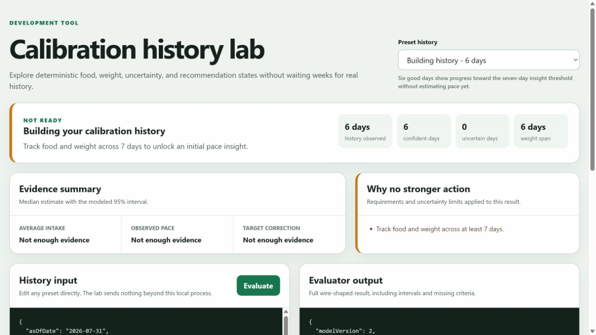
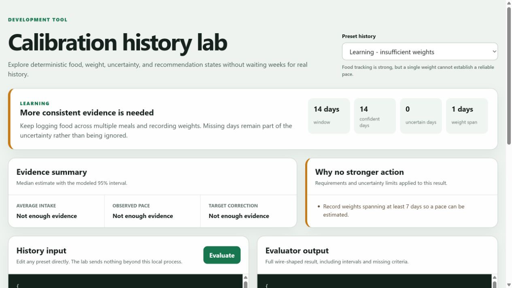
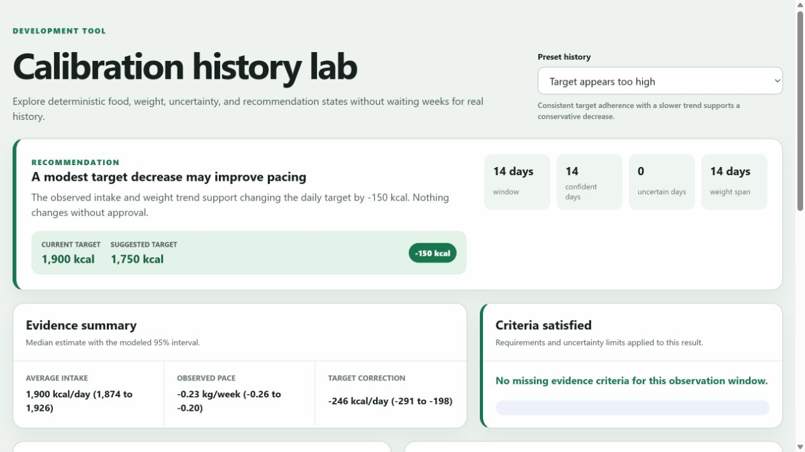
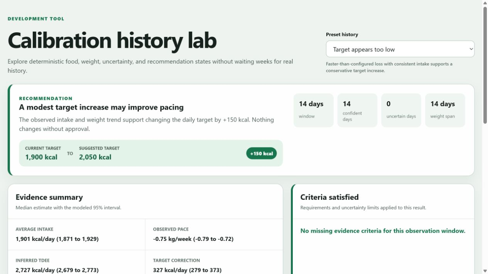
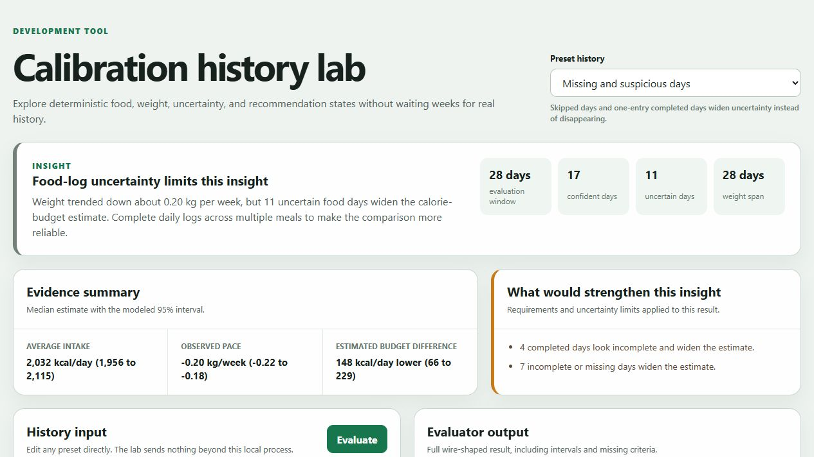
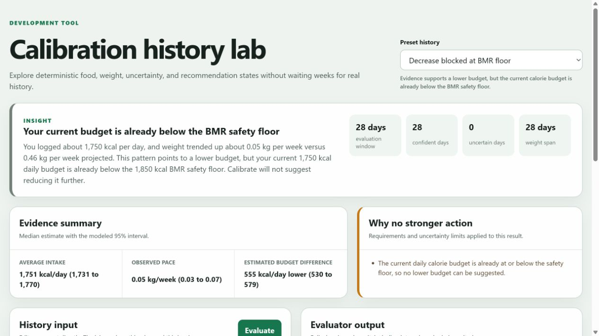
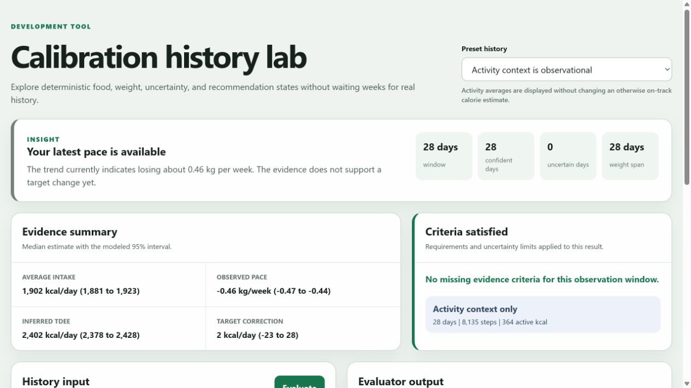

# Calibration insight manual QA

Tested on August 1, 2026 against the calibration history lab on PR #269.

## Scope and method

- Exercised all 14 shareable preset histories through the rendered development tool.
- Evaluated 7 additional edited histories for exact duration, weight-count, uncertainty, and age boundaries.
- Verified malformed JSON and structurally incomplete JSON remain in the lab with an actionable validation error.
- Inspected the rendered status, headline, evidence metrics, modeled intervals, target change, and gating criteria for each case.
- Ran a complementary 384-case deterministic invariant matrix across history length, age, pace, missing-day rate, weight uncertainty, and BMR floor position.
- Benchmarked 2,800 evaluations across the 14 presets: 2,353.1 ms total, or 0.84 ms per evaluation on this development machine.
- Repeated the rendered recommendation and uncertainty checks after rebasing onto the current mobile/day-status architecture and applying review feedback.
- Ran the full automated suites after the rebase: 415 backend tests, 363 mobile tests, 45 API-client tests, and 18 development-script tests.
- Built the production Expo web export and regenerated the Prisma and OpenAPI clients.

The lab invokes the same pure evaluator used by the service. This pass did not apply the Prisma migration to a live database because Docker was unavailable, so persistence and next-local-day activation remain covered by route and service tests rather than this browser pass.

## Result matrix

| History | Expected result | Observed result |
| --- | --- | --- |
| 6 complete days | `not_ready`, progress retained | Passed: 6 confident days and 6-day weight span are shown |
| 14 food days, 1 weight | `learning` | Passed: asks for a 7-day weight span |
| 7 complete days | Descriptive insight only | Passed: -0.45 kg/week, no recommendation |
| 28 on-track days | Insight, no target change | Passed: inferred correction interval crosses zero |
| Consistent slow loss | Decrease recommendation | Passed: shortest sufficient 14-day window, -150 kcal cap |
| Consistent fast loss | Increase recommendation | Passed: shortest sufficient 14-day window, +150 kcal cap |
| Prior -150 kcal adjustment | Reverse prior decrease | Passed: +150 kcal returns the adjustment to zero |
| Higher intake explains slow loss | Adherence insight | Passed: no profile-target correction |
| 7 missing and 4 suspicious days | Uncertainty insight | Passed: all 11 days remain in the interval and are explained |
| Broad weight confidence intervals | No recommendation | Passed: 424 kcal correction interval is rejected as too wide |
| Activity data present | Observational context only | Passed: same calorie estimate as on-track history |
| Downward signal above BMR floor | Floor-limited decrease | Passed: target stops at 1,850 kcal |
| Downward signal below BMR floor | No contradictory recommendation | Passed: downward evidence remains an insight with a floor explanation |
| 90 days supplied | 42-day cap | Passed: latest 42 days selected |
| 13 days with directional evidence | No early recommendation | Passed: explicitly requests 14 days |
| 2 weights spanning 14 days | Insight, no recommendation | Passed: explicitly requests a third weight |
| 1 missing day in 14 | Recommendation allowed if interval remains narrow | Passed: -150 kcal with singular uncertainty explanation |
| 1 suspicious day in 14 | Recommendation allowed if interval remains narrow | Passed: -150 kcal with singular uncertainty explanation |
| 10 incomplete days in 28 | No recommendation | Passed: uncertainty widens past directional confidence |
| All completed days suspicious | `learning` | Passed: asks for 7 plausible multi-meal days |
| Minor with otherwise actionable history | Insight only | Passed: adult-only criterion blocks recommendation |

## Issues found and addressed

1. **BMR floor could reverse recommendation direction.** A strong downward correction produced a positive target change when the current target was already below BMR. Downward changes are now blocked at or below the floor without fabricating an upward signal.
2. **Two weights could unlock a recommendation.** The action gate now requires at least three weights while still allowing a two-point descriptive pace.
3. **Pre-threshold progress appeared as zero.** Histories shorter than seven days now report their actual confident-day and weight-span progress.
4. **Weight pace was rounded too aggressively.** Weekly weight intervals now preserve three decimal places internally, producing accurate two-decimal user-facing pace text.
5. **Non-actionable criteria were hidden in the client.** The Progress card now lists what would improve an insight whenever no recommendation is available.
6. **Malformed structured JSON crashed the lab.** The editor now validates top-level and nested food, weight, and activity fields and preserves the last valid output on error.
7. **Single-day uncertainty copy had incorrect agreement.** Messages now use "looks/widens" for one day and "look/widen" for plural counts.
8. **The original lab depended on the retired Vite frontend workspace.** The lab now runs as a dependency-free local Node server against the compiled shared evaluator.
9. **The original six presets did not cover the full state space.** The lab now has 14 described, deep-linkable histories plus a clearly labeled custom-edit state and visual evidence summaries.
10. **The public result exposed a weight-derived expenditure estimate.** The evaluator now exposes only the bounded target correction; displayed calories out remains the profile-estimated TDEE.
11. **Accepted revisions could carry into a later goal.** Recommendations and plan revisions are now tied to their source goal, so a new maintenance or gain goal cannot inherit an older loss-goal adjustment.
12. **The feature migration collided with a migration added on `master`.** Calibration now uses migration `0031`, following the day-resolution migration at `0030`.

## Screenshots

### Building toward the first insight

### Learning while weight evidence is incomplete

### Conservative target corrections in both directions

### Missing and suspicious days remain visible

### BMR floor blocks a contradictory correction

### Activity remains observational context

## Assessment

The evaluator is behaving conservatively without requiring perfect logging. A single missing or suspicious day can still produce a recommendation when the full modeled interval remains directional, while larger gaps or broad weight uncertainty suppress action and explain why. The shortest sufficient history is selected for action, the longest bounded history supports descriptive insights, and accepted-adjustment feedback can move in either direction without exceeding the configured step cap.

The remaining manual-testing gap is the end-to-end database lifecycle: materializing, accepting, and activating a recommendation on the next user-local day. That flow should receive a live integration pass once a local Postgres environment is available.
