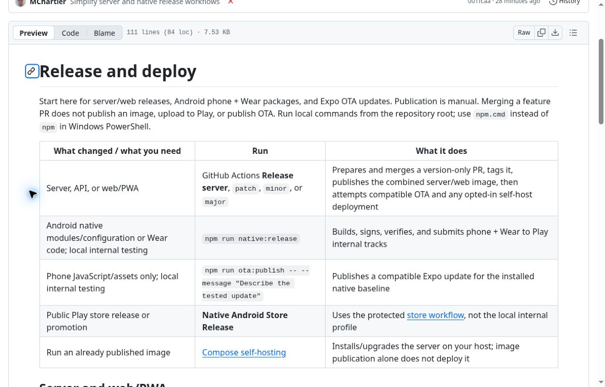
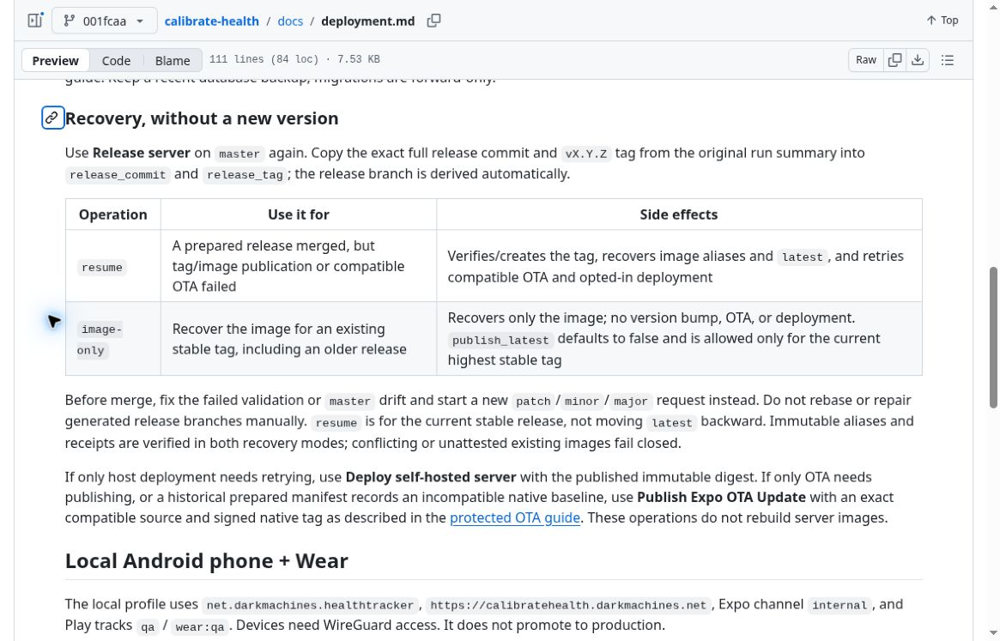
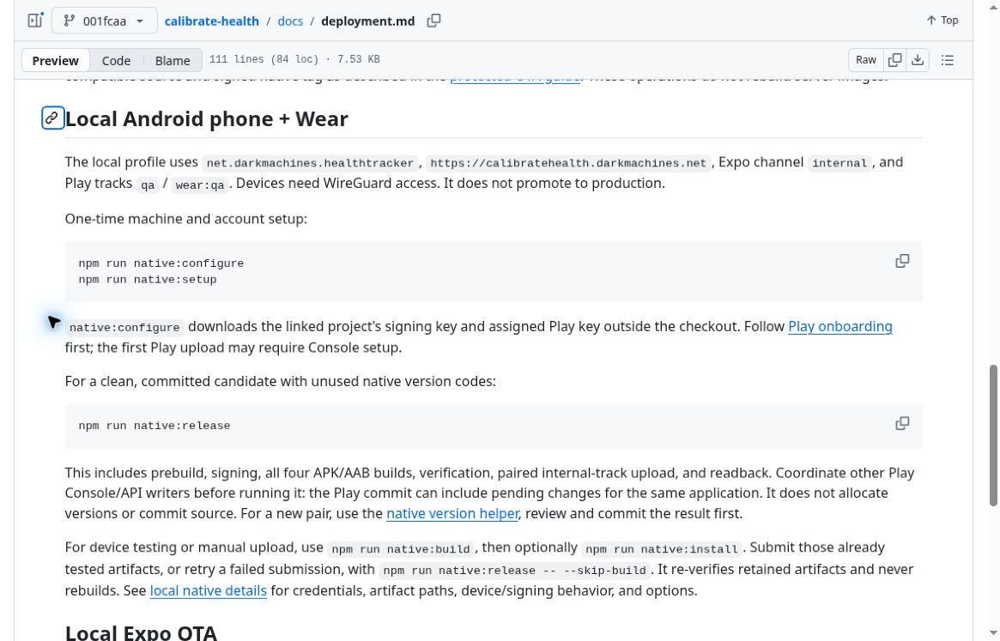

# Deployment cleanup screenshot evidence

Captured on 2026-10-01 in the cloud browser from GitHub's actual Markdown preview of
[`docs/deployment.md` at `001fcaad8cdc639809db3133571f2b95cb4e5e20`](https://github.com/MChartier/calibrate-health/blob/001fcaad8cdc639809db3133571f2b95cb4e5e20/docs/deployment.md).
The screenshots are unedited 1165 x 747 JPEG viewport captures. The repository file tree was collapsed and the
visible heading permalinks were used to frame each section.

These show the committed documentation's presentation and commands. They are not evidence of a completed
GitHub release, Play upload, OTA publication, or server deployment; none of those operations was triggered.

## Release chooser

## Recovery choices

## One-command local native release

