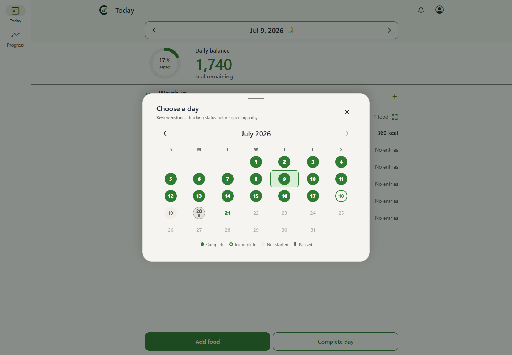
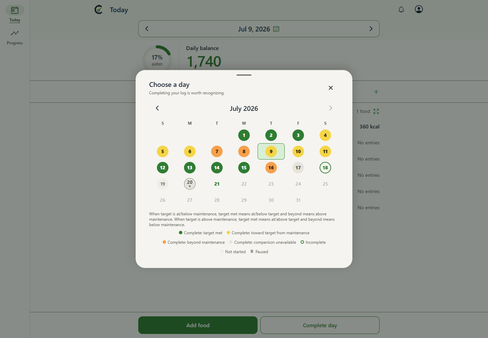
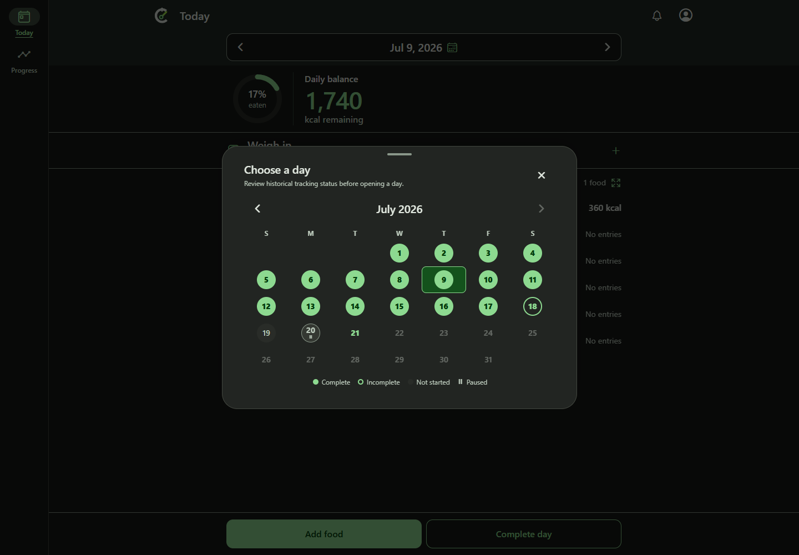
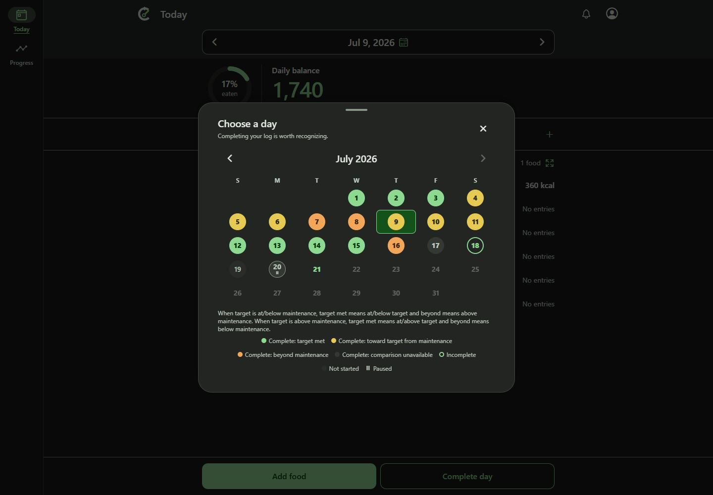

# Current master to final calendar comparison

Before is the actual target master 4728d4f75b70e6440a9778a42cd2224a300db725. After is the verified combined final source 872f7b5f00c5ace203e1d5c1b15b201c84e9dd48 (tree d4475f7630894ddd8fe3f87382a075615c182d49; ordered parents target master and PR head 6fadbcc6a6437609ae6e2d49d73ed3da95a94b47). The PR product branch is unchanged. This pair shows the complete proposed feature relative to its target base, not an intermediate implementation revision.

| Theme | Before: all completed days green | After: historical comparison bands |
| --- | --- | --- |
| Light |  |  |
| Dark |  |  |

Both pairs use actual Chrome 154.0.8037.95 on Windows at 1440 x 1000, scale 1, reduced motion, en-US, America/Los_Angeles; July 9 selected and clock frozen at July 21 2026 19:00 UTC. Same fixture bytes: 3b5c54a83e9832cd800125fd81398df44ee9fe70bdb8adb5e56c6681b2efdbde. The baseline ignores the new optional comparison fields in that response. No application code was changed to create the Before. Shared normalization suppresses unrelated transient PWA notices in both sources. Original pixels are retained, with no cropping, redaction or image editing.

Days 1-7 exercise loss (T=2000/M=2500), 8-13 gain (T=3000/M=2500), and 14-16 equality. July 17 is completed with unavailable history. Before all 17 completed days are green. After all three comparison colors and neutral unavailable history appear, while dates remain readable, July 9 stays selected and incomplete/not-started/paused remain recognizable. The new completion acknowledgment, directional explanation and expanded legend increase dialog height; that is the product change, not an input mismatch.

## Source and capture verification

Before was freshly built/served from an isolated checkout of actual master. The build-and-capture command in manifest.json uses the repository runner, which builds that checkout's mobile/dist and serves it on a loopback port before launching Playwright. Both baseline captures passed. Copy before.capture.spec.ts into e2e/expo-web/pr410-base-capture.spec.ts and retain fixture.json at this directory to reproduce. The initial assertion assumed final-only selected wording; it was corrected to assert master's actual accessible name, without editing product code.

After PNGs and capture records are byte-identical copies from 49a58ea6610c9c2dd57764ab90e5dffbf0c32959. The retained after-original-manifest.json binds the original source, all 174 built outputs, capture command and fixture; after.capture.spec.ts preserves that exact harness. Reproduce that harness using its original output path docs/pr-screenshots/issue-408/integrated-4728d4f. All current final build bytes were checked against that original record again. The fixture helper, Playwright config and runner have identical source bytes between Before and After. Capture records preserve their real timestamps; After was not relabeled as newly captured.

manifest.json binds both full source identities, pairs, image/capture/fixture/harness digests, and every baseline build artifact. Exact-image visual inspection performed for all four captures. The final source is unchanged from the integrated desktop run: 14 maintained scenarios plus four captures passed and one phone-only scenario was intentionally skipped. That run covers focus/selection, edit/recomplete, failure/retry and responsive navigation. The new work is baseline evidence and presentation only; no unaffected suites or review-bot retries.

## Retention

Owner: issue #408 sole implementation owner. Purpose: durable actual-base-to-final review evidence. Keep evidence/pr410-base-to-final-4728d4f unmerged and immutable during routine cleanup. Existing evidence/pr410-reviewed-d8e55c and evidence/pr410-integrated-4728d4f and all older receipts remain unchanged. Nothing in this evidence directory belongs in the product PR merge diff. Native/device and live backend observations remain unexecuted; independent QA assesses the revised PR narrative separately.
