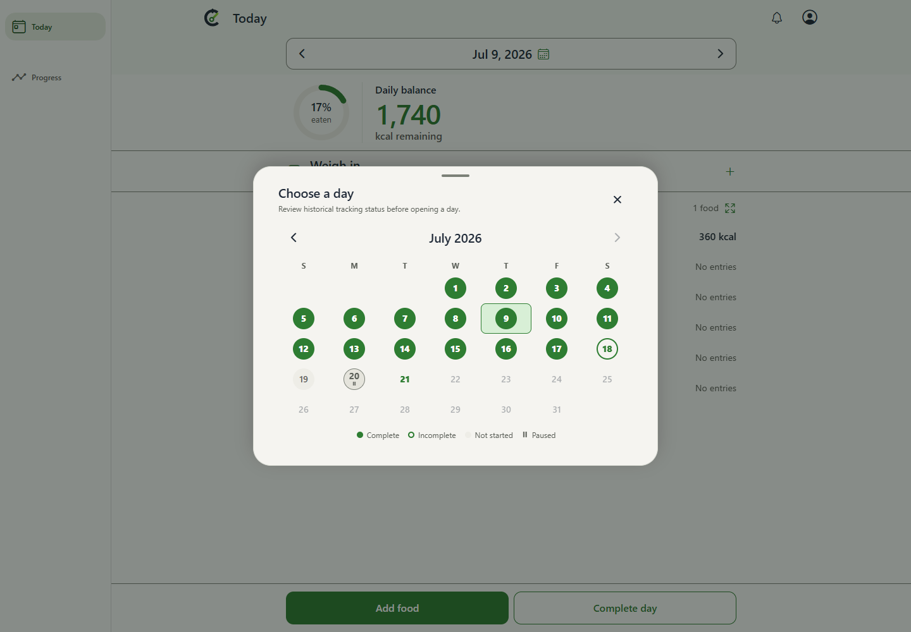
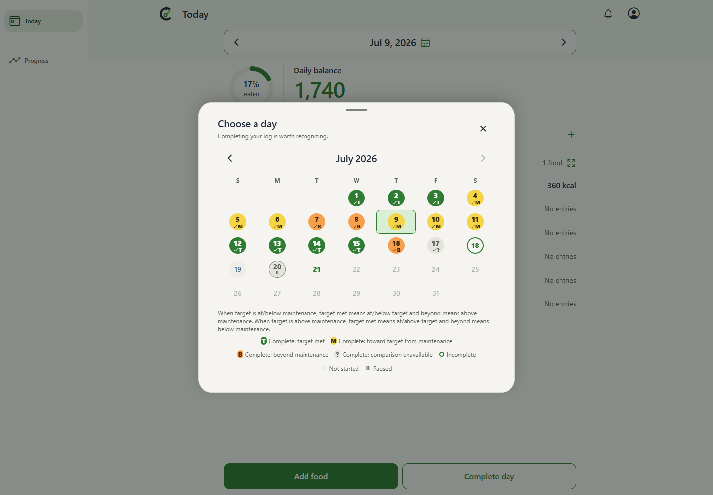
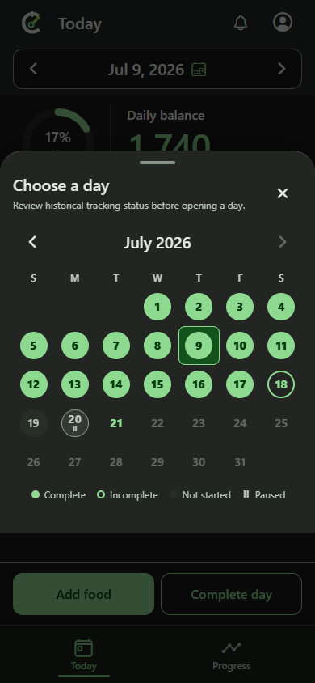
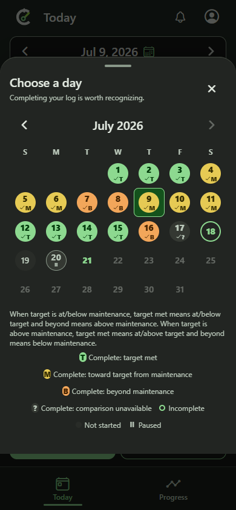

# Matched before/after evidence for issue 408

These are genuine, unedited Chrome browser screenshots of **Today > Choose a day**, captured on Windows from separately built source revisions. They are not emulator/device screenshots. No personal data, image manipulation, UI hiding, or simulated baseline was used.

- Before source: `29fb444ae4389ca81f3437d24685ed9badc43410` (actual baseline source in a new detached worktree).
- After source: `3d2b4959b6592cfeb3dcf60dc2ca818e219eacc5` (the implementation source, before this evidence-only commit).
- Both use identical [fixture bytes](fixture.json) and the same [capture harness](capture.spec.ts), shared repository fixture module and Playwright configuration. Baseline code simply ignores the additive comparison fields; its tracked source was not modified.
- Matched state: July 2026 calendar, July 9 selected, clock frozen at July 21 2026 19:00 UTC, America/Los_Angeles, en-US, reduced motion, device scale factor 1, Chrome 154.0.8037.95. Within each pair, viewport, theme, actions and response bytes are identical.

## Desktop light: 1440 x 1000

| Before: every completed day is green | After: each saved plan determines its band |
| --- | --- |
|  |  |

July 7 (loss intake above maintenance) and July 8 (gain intake below maintenance) change from green to orange. Selected July 9 changes to yellow while retaining its outer selection border. July 17 remains completed but becomes neutral because its historical comparison is unavailable. The current UI adds check/letter cues and factual legend text.

## Phone-sized browser dark: 390 x 844

| Before: compact status-only calendar | After: comparison cues and wrapping legend |
| --- | --- |
|  |  |

The same history and selection remain visible at the narrow viewport. Both screenshots show the full viewport; the taller after sheet is the actual layout required by its additional explanation and legend. It was not resized or repositioned for the comparison.

## Provenance and inspection

[Manifest](manifest.json) records each PNG's SHA-256, source revision, real capture timestamp, dimensions, browser version, fixture/harness hashes, shared tooling Git blobs, and production export/bundle hashes. All four images were inspected after capture for the actual before/after change, selected date, readable dates/cues/legend, responsive layout, and clipping. This correction supplements the [13 detailed after-state images](../README.md); it does not replace their boundary, recovery, light/dark and enlarged-text evidence.

The explicit user amendment to pinned workflow-v3 / pr-review-v2 is applied here as a blocking requirement: UI changes need genuine, representative before/after pairs visibly embedded in the PR, reproducible matched state and traceable originals. Links to after-only images do not satisfy that requirement. Canonical workflow publication is coordinated separately. The new evidence and final PR body require renewed independent QA before any readiness claim.

## Reproduction and executed results

1. Prepare separate isolated checkouts at the exact before/after revisions with repository-owned `node .codex/local-environment.setup.mjs`. Do not edit tracked product source.
2. Temporarily copy `capture.spec.ts` to `e2e/expo-web/issue-408-comparison-capture.spec.ts` in each checkout. Set `CALIBRATE_COMPARISON_FIXTURE` to the absolute path of this archived fixture and `CALIBRATE_COMPARISON_OUTPUT` to an absolute scratch output folder shared by both runs.
3. Set `CALIBRATE_COMPARISON_STAGE` to `before` or `after`, and `CALIBRATE_COMPARISON_SOURCE` to that checkout's verified full SHA. Use distinct loopback ports through `CALIBRATE_EXPO_WEB_PORT`; the actual runs used 41784 and 41785. Leave `CALIBRATE_EXPO_WEB_BASE_URL` unset so the repository runner builds that checkout's production web artifact.
4. In each checkout run:

`npm.cmd run test:web:e2e -- e2e/expo-web/issue-408-comparison-capture.spec.ts --project=desktop-chrome --project=android-phone-chrome --workers=2`

Both production builds passed. Baseline capture: **2/2 passed**. Current capture: **2/2 passed**. All four screenshots are direct full-viewport browser captures. The harness checks baseline completion labels/legend and current selected/comparison-unavailable labels/legend before capturing. The unchanged original behavioral suite and independent QA cover the complete comparison inequalities and recovery; this narrow correction changes no product behavior.

5. Remove only the temporary harness copies. Verify both tracked product trees are unchanged, compute PNG/fixture/harness hashes, inspect the pixels, and retain originals. This publication contains only files under `docs/pr-screenshots/issue-408/`.

Repository launcher note: `npm.cmd run worktree:new` created valid relative Git metadata but its redundant rewrite of the new .git file hit EPERM. Git verified the created worktree, which was then detached at the exact baseline. No launcher/source fix, shared-service restart, child-branch modification or Docker startup was required.
