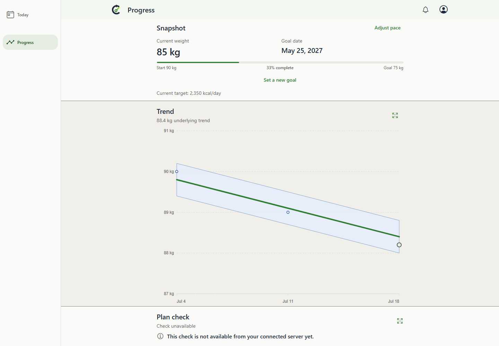
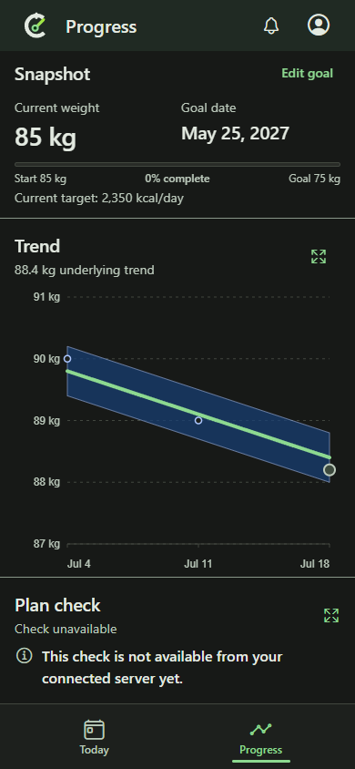
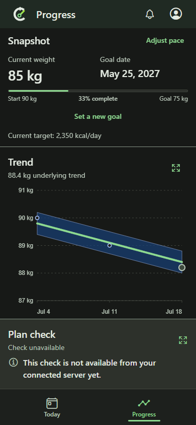

# Matched before/after: changing pace without resetting progress

These unedited PNGs show real Chrome on Windows serving production Expo web exports from two exact revisions. The common capture harness supplies identical synthetic starting data and endpoint semantics to both builds. It clicks each revision's actual action. It does not hide new UI to manufacture a baseline or substitute final-state screenshots.

- **Before:** `230c31f120d27811228ed566f7dbb0ff6106288a`, parent PR410, separately checked out and built without product edits.
- **After:** `4cf0867c97d5e94944b3036bf789f00ebd4bf825`, child409 implementation with parent evidence integrated.
- [Manifest](manifest.json): PNG SHA256s, source revisions, browser version, viewport/theme, capture timestamps, final API readbacks, harness/shared-fixture hashes and exported HTML/JS hashes.
- Harness: `e2e/expo-web/goal-pace-comparison.spec.ts`. Starting goal7 was created January1, start90/target75/current85 kg, deficit500; frozen clock July21 2026, America/Los_Angeles, en-US, reduced motion, scale1.
- Normalization: the shared `hideTransientPwaNotices` helper suppresses unrelated transient notices on both builds. No comparison content is hidden or modified, and no image is edited. Trend data remains the same synthetic fixture in both builds; this is not a live personal account or native-device run.

## Desktop light: 1440 x 1000, after saving 250 kcal/day

| BEFORE: baseline resets to85kg and0% | AFTER: baseline90kg and33% preserved |
| --- | --- |
|  |  |

## Phone-sized browser dark: 390 x 844, same action

| BEFORE: replacement goal | AFTER: existing goal |
| --- | --- |
|  |  |

Both show target2350 after selecting250. The saved response confirms the old POST creates goal8 with July21 start and85kg baseline; the new PATCH retains goal7, January1 start,90kg baseline, target75 and stored target-date intent. Initial and editor originals are also retained: the new editor visibly states the original date and preservation policy.

## Capture steps and results

1. Prepare isolated checkouts at the two exact sources with `node .codex/local-environment.setup.mjs`, then build each with `npm.cmd --prefix mobile run build:web`.
2. Serve each checkout's own artifact using its `node scripts/expo-web-static-server.mjs --port PORT`; actual runs used4189 before and4188 after. No shared Docker services are needed.
3. From the child checkout run the common Playwright harness against each loopback URL via `CALIBRATE_EXPO_WEB_BASE_URL`. Set `CALIBRATE_PACE_COMPARE_STAGE=before` or `after`, `CALIBRATE_PACE_COMPARE_SOURCE` to the matching full source SHA, and `CALIBRATE_PACE_COMPARE_DIR` to an output directory. Run `npx.cmd playwright test --config playwright.expo-web.config.ts e2e/expo-web/goal-pace-comparison.spec.ts --project=desktop-chrome --project=android-phone-chrome --workers=2`.
4. Before2/2 and after2/2 tests passed. Both production builds passed. Inspect the actual initial/editor/saved pixels, archive readbacks, and hash the originals. These images were inspected for the changed baseline/progress and responsive editor; CI/backend tests provide persistence evidence separately.

The PR embeds the matched saved-state pairs near its Summary/Test plan. Independent QA must inspect both actual pixels and the rendered PR; it remains pending at publication.
