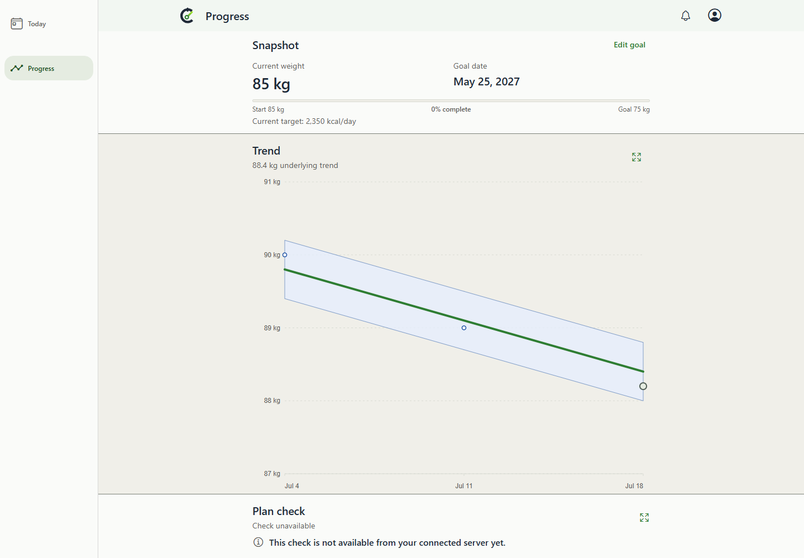
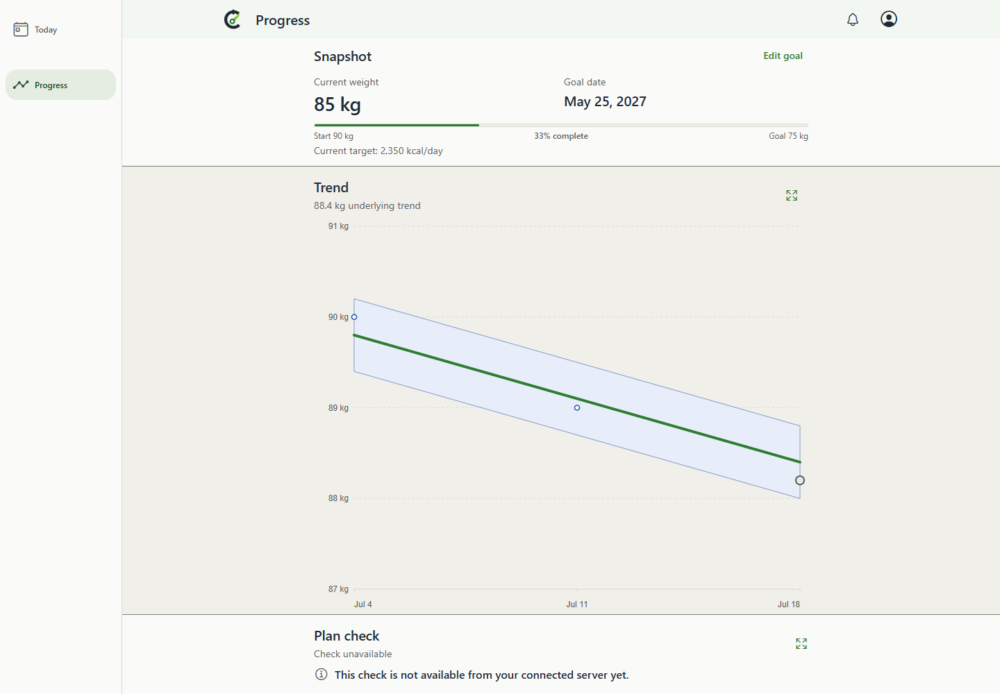
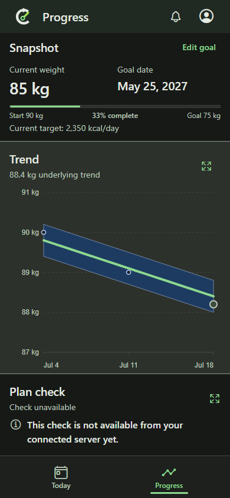
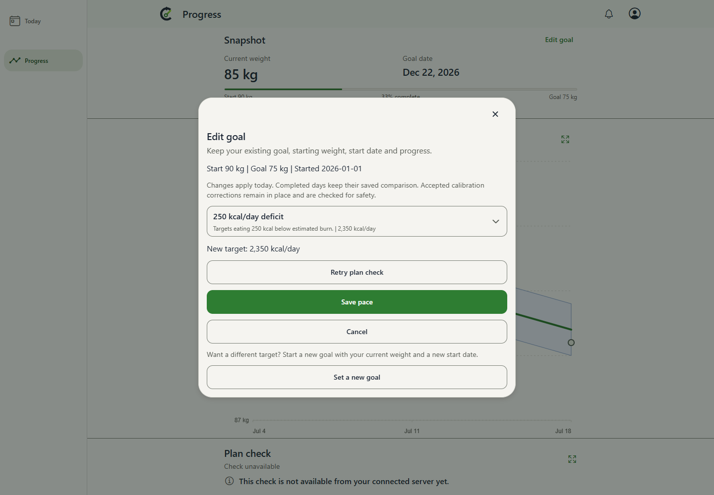

# Edit goal: current matched evidence

This capture set supersedes the UI presentation evidence for PR415 after Matthew's request to put pace controls inside Edit goal. Older captures, manifests and QA records remain unchanged in their original locations.

- **Before:** actual parent PR410 source `d8e55c105834093f889b2cff2a5c96d224cc6e80`, separately checked out, set up and built without product edits.
- **After:** product source `18c5b04d3eeb70e985810c53a4ed40e1e2ec0b55`, with that exact parent integrated.
- [Manifest](manifest.json) binds source commits, shared fixture/harness SHA256s, exported JavaScript/Progress HTML hashes, original PNG SHA256s and API readbacks.
- Chrome 154.0.8037.95 on Windows; production Expo web builds; synthetic API fixtures. These are browser observations, not native device or live database observations.
- Same goal7, original January1 start90kg, target75kg, current85kg, deficit500; select250. Clock July21 2026 at19:00Z, America/Los_Angeles, en-US, scale1 and reduced motion. Shared fixture suppresses unrelated transient PWA notices identically; no comparison content or image pixels edited. Trend remains the shared synthetic fixture.

## Matched saved result

| BEFORE: replacement loses the baseline | AFTER: existing goal retains the baseline |
| --- | --- |
|  |  |
|  |  |

Both select250 and show2350kcal/day with the revised forward date. Before creates goal8 at85kg with July21 start and0%; after retains goal7, start90kg, January1 date, target75kg, stored target-date intent and33%. The current editor visibly shows the original baseline/date and the separate intentional new-goal action:

The initial readbacks record exactly one Snapshot action, Edit goal, and a183px card height in both revisions at both viewports. There is no extra top-level link or added Snapshot height. Initial/editor/saved originals are retained. Pixel inspection confirmed the saved-state pairs, original-date editor, phone layout and compact/large-text controls.

## Executed checks

- Matched baseline2/2 and current2/2 passed against their separate production exports.
- Current browser8/8 passed at1440/820/390/320 widths, light/dark. The [flow harness](../../../../e2e/expo-web/goal-pace.spec.ts) exercises cancellation without writes, dirty new-goal handoff decline/accept, simulated503aftercommit retry with one operation/write, authoritative reopen/reload, preserved historical target2100, explicit new goal8/85kg/0%, Escape and focus restoration after cancelling the new-goal form. Axe found no blocking violations;320px/200% text reached Save and Close. Supporting originals are under `behavior/`.
- Local client213suites/1079tests and all TypeScript surfaces passed. Both production web builds passed. CI and configured review results are linked in the PR discussion/body at their exact heads.
- Local Docker remained unavailable; no shared service recovery was attempted. Actual PostgreSQL persistence/concurrency and populated-upgrade evidence comes from CI. Native emulator/device/Watch runtime checks are unexecuted.

## Reproduction

1. Set up each isolated source with `node .codex/local-environment.setup.mjs`; build with `npm.cmd --prefix mobile run build:web`.
2. Serve its own `mobile/dist` through `node scripts/expo-web-static-server.mjs --port PORT`. These runs used4189 before and4188 after.
3. From the after checkout set `CALIBRATE_EXPO_WEB_BASE_URL` to the corresponding loopback server, `CALIBRATE_PACE_COMPARE_STAGE` to before/after, `CALIBRATE_PACE_COMPARE_SOURCE` to that full source SHA, and `CALIBRATE_PACE_COMPARE_DIR` to a new output directory. Run `npx.cmd playwright test --config playwright.expo-web.config.ts e2e/expo-web/goal-pace-comparison.spec.ts --project=desktop-chrome --project=android-phone-chrome --workers=2`.
4. Run the behavioral suite against the current server with `CALIBRATE_PACE_EVIDENCE_DIR` pointing to a new directory: `npx.cmd playwright test --config playwright.expo-web.config.ts e2e/expo-web/goal-pace.spec.ts --workers=4`.

Manifest SHA256: `dee0f0ff23a708ae27c14775577aeec30e6e66d0b69913c75a0a4475db61e43f`. Previous provenance remains at commit41cbe944430cbe3c498bf5b0546dd6906474f549; none of its originals were overwritten. Independent QA/readiness is recorded by the coordinator and reviewer in append-only PR comments.
