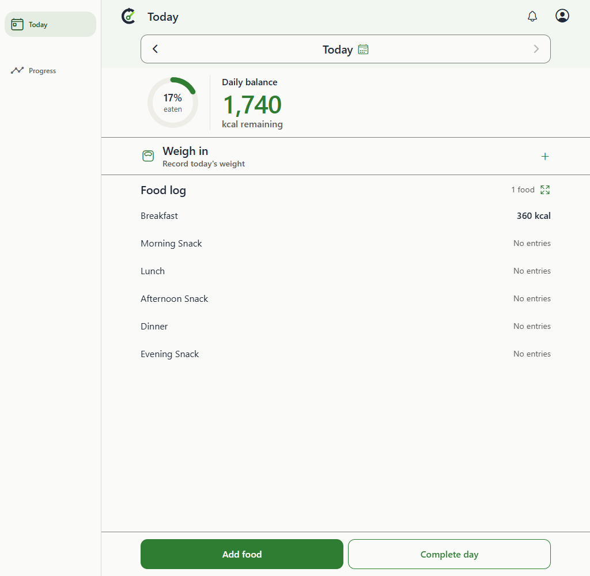
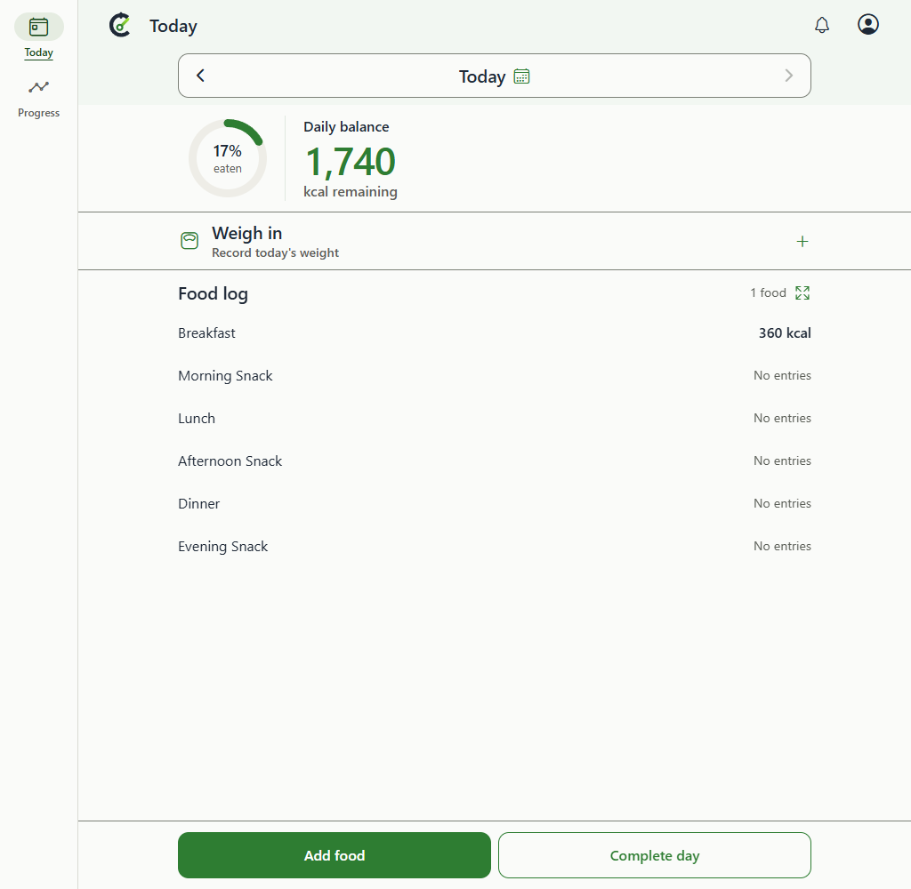
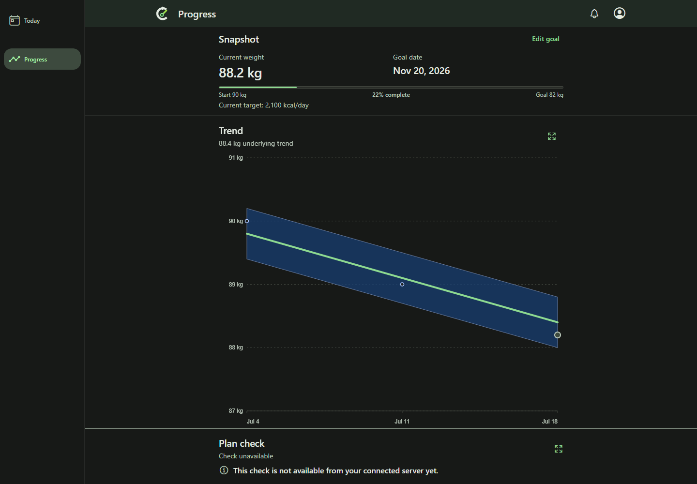
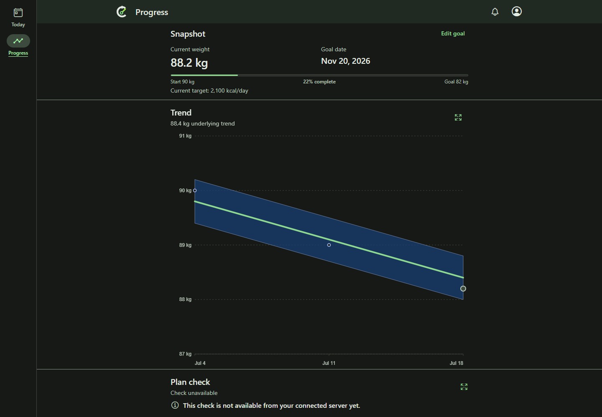

# Compact web navigation rail: browser evidence

Desktop users previously lost 176px to a sparse sidebar. The web-only rail uses an 88px column,
puts icons above readable Today/Progress labels, and groups the links with a 4px gap. Selection uses
an icon pill and label underline. The whole link keeps guarded navigation and visible keyboard focus.
The rail can grow with enlarged text; measured width also positions the food-log action.

| Before: Today, 1024px, light | After: Today, 1024px, light |
| --- | --- |
|  |  |

| Before: Progress, 1440px, dark | After: Progress, 1440px, dark |
| --- | --- |
|  |  |

## Revisions and capture provenance

- Baseline/base: `29fb444ae4389ca81f3437d24685ed9badc43410`, verified remote master.
- Changed application and capture harness: `3aab5d673d9c9bb35986ff724ca4eac0ba81cbcc`.
- The following evidence-only commit does not change application source. Captures identify the actual
  exported source above, not a later evidence commit. No parent PR or other worker's code was imported.
- Separate Windows checkouts, Expo exports and loopback static servers were used. Both final exports
  were built after their source revisions existed, with no tracked application modifications. Only the
  same capture spec was copied into the baseline checkout as an untracked test harness.
- Setup in both checkouts: `node .codex/local-environment.setup.mjs`.
- Build in each: `npm.cmd --prefix mobile run build:web`.
- Serve: `node scripts/expo-web-static-server.mjs --port 44112` (Before) / `--port 44111` (After).
- Capture from each matching checkout: set `CALIBRATE_EXPO_WEB_BASE_URL` to its loopback server,
  `CALIBRATE_RAIL_SOURCE_SHA` to the corresponding full SHA, and `CALIBRATE_RAIL_CAPTURE_DIR` to
  the respective output directory. Set `CALIBRATE_RAIL_BASELINE=1` only for Before. Run
  `node node_modules/@playwright/test/cli.js test e2e/expo-web/compact-rail.spec.ts --config=playwright.expo-web.config.ts --project=desktop-chrome --workers=1`.
- Each JSON records source, UTC capture time, Chrome version (154.0.8037.95), viewport, scale, theme,
  route, geometry, image SHA-256, and hashes of loaded JS/CSS. The harness fetches those actual served
  assets and asserts their bytes match that checkout's `mobile/dist`. There are 29 pairs / 58 originals.
- `manifest.json` binds the images, JSON, sanitized build logs, README, harness, fixtures and source
  identities. Use the evidence commit's full SHA in reviewer links to bind the provenance record itself.
  Source hashes use committed bytes; optional working-copy hashes distinguish Windows line endings.

## Shared fixture normalization

Both runs use synthetic populated/empty API data, clock `2026-07-21T19:00:00.000Z`,
`America/Los_Angeles`, `en-US`, reduced motion and device scale 1. The notification case adds the same
synthetic reminder to both sources. Baseline mode skips new-rail assertions only; it never changes UI.
Pointer position is normalized to (0,0) before the responsive sequence so moving controls do not
acquire incidental hover. Rail, page, shell and account controls are never hidden.

The shared `hideTransientPwaNotices` helper suppresses Back online, Update ready, Update failed,
and Updating Calibrate in both normal capture sequences; service workers are blocked. Suppression
is lost on the explicit reload and is intentionally not reapplied until after notification/offline
captures. Thus offline pairs visibly retain the actual offline and update-failed notices, identically
on both sources. These are synthetic-browser shell states, not production connectivity evidence.

The 200% helper scales text and icon-font glyphs on both sources. This is simulated text enlargement,
not actual browser zoom or native font scaling. Images are original viewport screenshots (not full
scrolling-page captures); none were cropped, redacted, painted, generated or reconstructed.

## Behavioral test plan and observed results

| Starting state / action | Expected | Observed / evidence |
| --- | --- | --- |
| Populated Today/Progress at 1024/1440px, light/dark | Recover space with readable labels and coherent content | All eight changed cases measure 88px, versus the prior 176px. Content occupies the recovered region with no duplicate gutter. `today-*`, `progress-*`. |
| Empty Today; Tab to Progress, Enter, Back/Forward, Ctrl-click Today | Visible focus, correct selection/history, canonical new-tab link | Focus outline visible; route/selection assertions pass. Ctrl-click opens `/today` while original remains Progress. `empty-*`, `keyboard-focus-*`, `hover-*`. |
| Resize 1023/1024/820/390/320/1440px | Bottom tabs below unchanged 1024px boundary, rail above | All transitions pass; 390px before/after images are byte-identical after pointer normalization. `responsive-*`. |
| 1024x480 with simulated 200% text | Readable labels, reachable links, no horizontal document overflow | Rail grows intrinsically, labels remain full, no horizontal document overflow. `text-200-short-*`, `forced-colors-text-200`. |
| Food log direct URL and reload, both themes | Today selected; FAB aligned with toolbar/content | Reload keeps selection; right-edge alignment within 1px. `food-log-fab-*`. |
| Open notification, Escape, then offline | Drawer readable; dismissal/focus and shell access retained | Reminder visible, Escape closes it; account control and rail remain visible offline. `notification-overlay-*`, `offline-shell-*`. |
| Selected/unselected hover, press, forced colors | Visible distinct interaction feedback | Theme hover/press styles differ; forced-color hover dashed and pressed double outlines are asserted. `unselected-hover-*`, `forced-hover-*`. |
| Dirty Profile details/Preferences; tabs/header/Back; pending save | Cancel retains draft; confirmation departs; pending save blocks | Existing guarded-navigation browser scenarios passed. |
| Member/admin settings, direct routes, expanded Trend, weight overlay | Permissions and route-return behavior preserved | Existing permission, nested-route and keyboard suites passed. |

Executed validation:

- `npm.cmd run lint`: all TypeScript surfaces passed.
- `npm.cmd --prefix mobile test -- --runInBand`: 213 suites / 1053 tests passed.
- Focused rail/guard/layout/registry component run: 4 suites / 32 tests passed.
- `npm.cmd run test:expo-web:release`: 16 passed; both final source exports passed.
- Final focused browser capture suite: 11 passed per source, including forced-color feedback.
- Final desktop and phone-web navigation/keyboard/permission run: 38 passed, 2 opt-in captures skipped.
- Broader rail/page-expansion/release-smoke browser matrix: 65 passed, 51 project-specific skips.
- Final `npm.cmd run test:ux` without snapshot-update mode: 252 passed, 79 project-specific skips.
  This includes WCAG A/AA critical/serious gates and visual snapshots. All 22 changed desktop snapshot
  images were inspected before acceptance; compact/tablet snapshots and thresholds were preserved.
- `git diff --check`: passed before publication.

The initial DOM-tab semantics, a bottom-tab test selector and a Jest mock-hoisting failure were fixed;
the initial desktop visual differences were reviewed as the intended rail change. Earlier failing
runs are not counted as passes. Final screenshot pixels reviewed include Today 1024 light, Progress
1440 dark, food-log FAB dark, notification overlay dark, offline shell light, forced-color hover light,
390px responsive and short enlarged-text pairs, plus keyboard focus. Normal light/dark variants and
the 22 desktop UX snapshot updates were also inspected during implementation.

Configured Codex review identified a guard continuation that bypassed the cancellable tab event.
Two integration regressions reproduced it using the real GuardedTabButton. The rail now emits the
same event before canonical Expo routing on ordinary and approved departures. Browser validation
also caught retained-state dispatch adding an unwanted history entry; canonical routing fixes that
without changing the existing mobile/native guard default. Final cancel/confirm/Back/re-arm scenarios
pass on desktop and phone web. These intermediate failures were corrected, not suppressed.

Current-head hosted CI, configured Codex review and rendered PR embeds are recorded on the PR after
publication. Independent QA is assigned separately by the coordinator; this evidence is not its verdict.
No native runtime/emulator checks or actual browser zoom were run. Native preservation is supported by
platform-specific source selection, component tests and unchanged existing navigator behavior only.

Workflow-v3 execution pin: `f0919b184b6344d6279178b2388190936ca432a9`. Final pr-review-v3 and
queue standards: `97e5583c8355f3673aad0835c0ce3ca1486aeb8b`. QA verdicts use append-only
superseding comments and trusted comment-ID/full-body-digest receipts. No readiness label, merge,
release or deployment is authorized by these implementation results.
