# Self-hosting web UI evidence

These are unedited screenshots of the real exported Expo web app rendered in Chromium with synthetic API fixtures.

## Provenance

- Captured source / PR head: [`df7e610812408e59a1e340dd8f32ab94fe4b4289`](https://github.com/MChartier/calibrate-health/commit/df7e610812408e59a1e340dd8f32ab94fe4b4289)
- Workflow merge commit: `7da082409f7a903133e84f53576b656b4c965dd7`
- [Builds run 36913482326](https://github.com/MChartier/calibrate-health/actions/runs/36913482326), Web Critical Smoke job `110541689812`: **24 tests passed in 37.0 seconds**, including eight screenshot tests; no retries
- [Original artifact](https://github.com/MChartier/calibrate-health/actions/runs/36913482326/artifacts/11188925700): `self-hosting-web-36913482326-1`
- Phone web viewport: **390 x 844**, Chromium mobile emulation
- Desktop web viewport: **1440 x 1000**, Chromium
- [Aggregate manifest](manifest.json) preserves every original per-image manifest record, including source and workflow SHAs, route, viewport, test title/retry, and PNG SHA-256

All 14 original PNGs were copied byte-for-byte from the CI artifact. The archive digest, individual image digests, dimensions, and source commits were verified before inclusion.

## Scope

- The app is served from the loopback self-hosted preview at `http://127.0.0.1:4174`; API responses and `.invalid` accounts are synthetic fixtures
- No real account login, customer data, production service, or role mutation is involved. The role-confirmation flow is cancelled and asserts zero role-change requests
- These captures cover the web experience, including its browser-origin boundary. The native-only server chooser and the live Calibrate managed service are not exercised
- The service identity and browser-boundaries images are intentionally identical: the whole service page fits at both captured viewport sizes
- Visual review found readable controls, responsive confirmation layouts, and no blank/error render or horizontal clipping. The phone Users and roles capture includes its section heading

## Gallery

Click an image to inspect the original full-resolution PNG.

### Sign in

| Phone web, 390 x 844 | Desktop web, 1440 x 1000 |
| --- | --- |
| [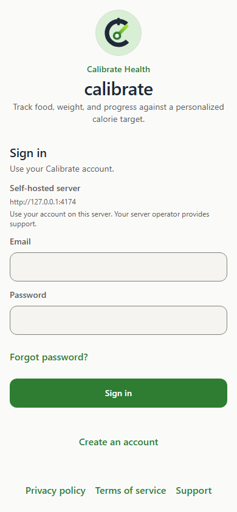](android-phone-chrome-sign-in.png) | [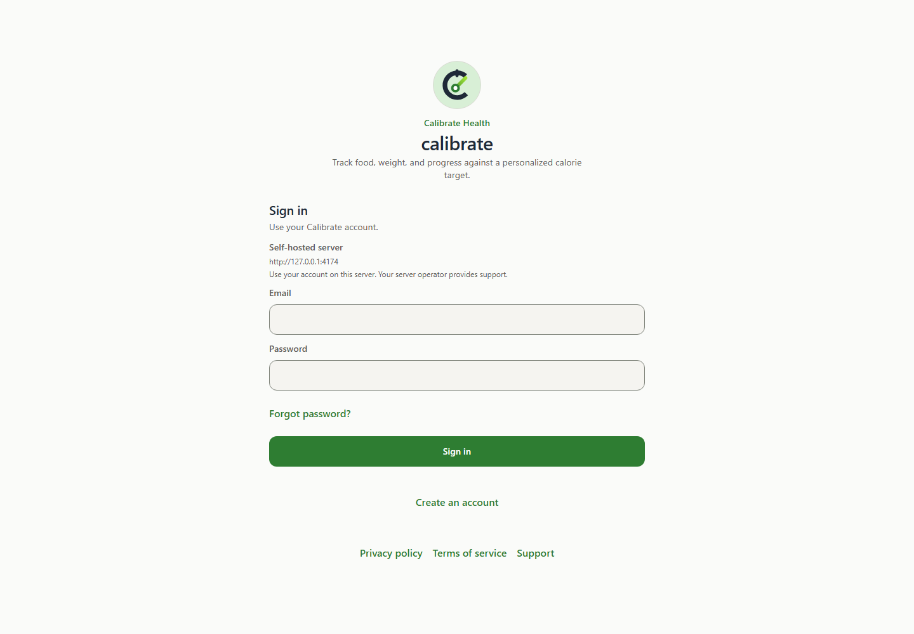](desktop-chrome-sign-in.png) |

### Settings service entry

| Phone web, 390 x 844 | Desktop web, 1440 x 1000 |
| --- | --- |
| [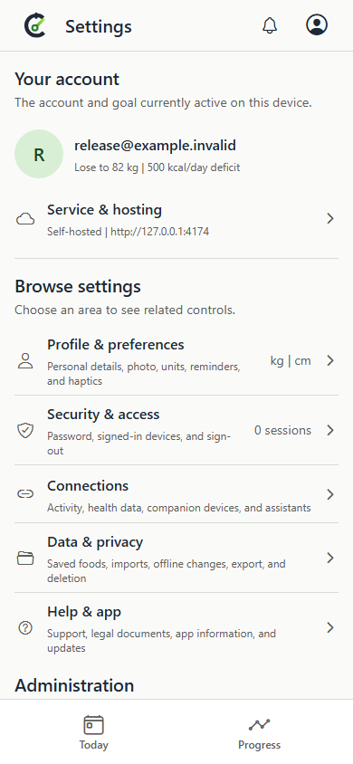](android-phone-chrome-settings-service-entry.png) | [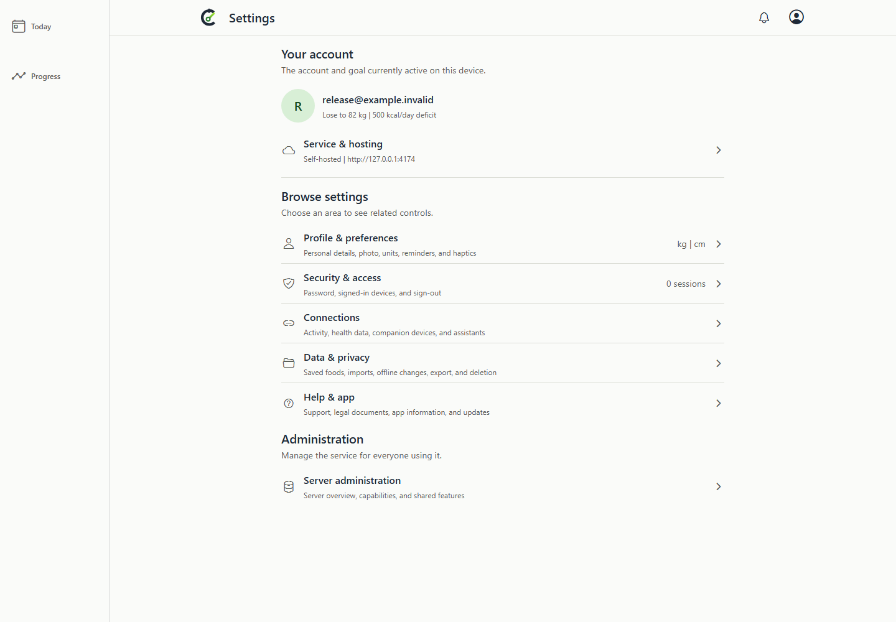](desktop-chrome-settings-service-entry.png) |

### Service and hosting

| Phone web, 390 x 844 | Desktop web, 1440 x 1000 |
| --- | --- |
| [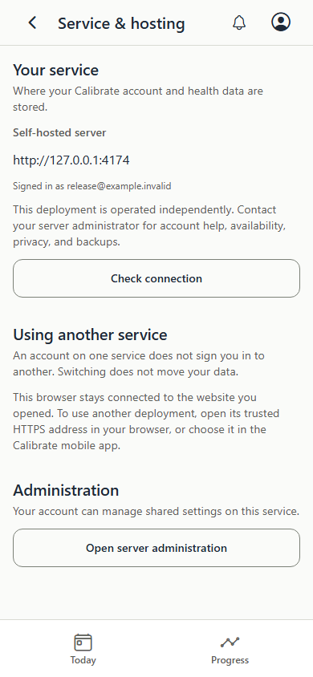](android-phone-chrome-service-hosting.png) | [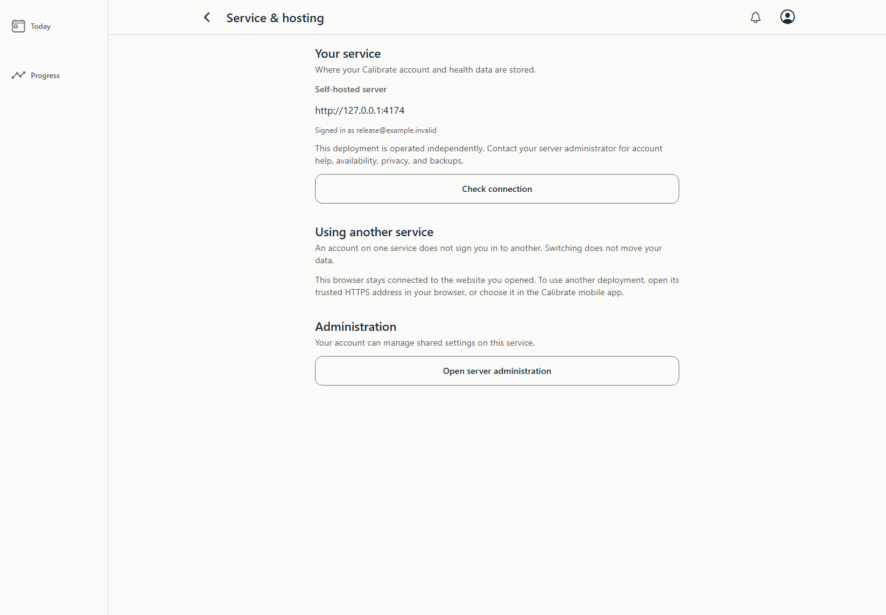](desktop-chrome-service-hosting.png) |

### Browser service boundaries

| Phone web, 390 x 844 | Desktop web, 1440 x 1000 |
| --- | --- |
|  |  |

### Administrator overview

| Phone web, 390 x 844 | Desktop web, 1440 x 1000 |
| --- | --- |
| [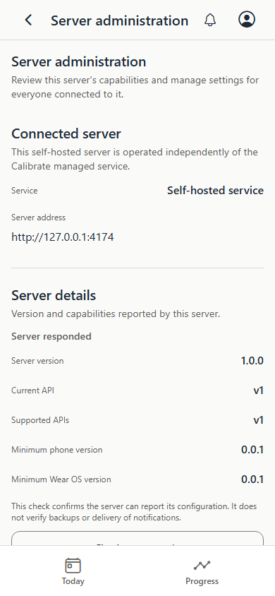](android-phone-chrome-administrator-overview.png) | [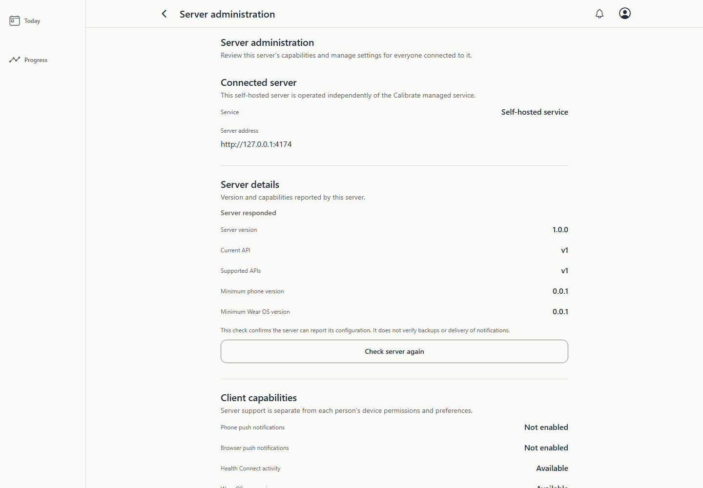](desktop-chrome-administrator-overview.png) |

### Users and roles

| Phone web, 390 x 844 | Desktop web, 1440 x 1000 |
| --- | --- |
| [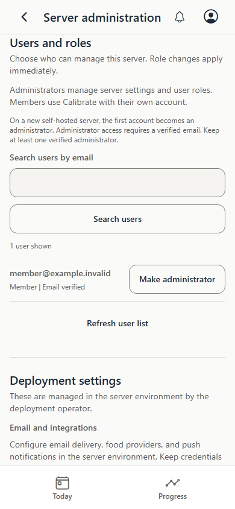](android-phone-chrome-users-and-roles.png) | [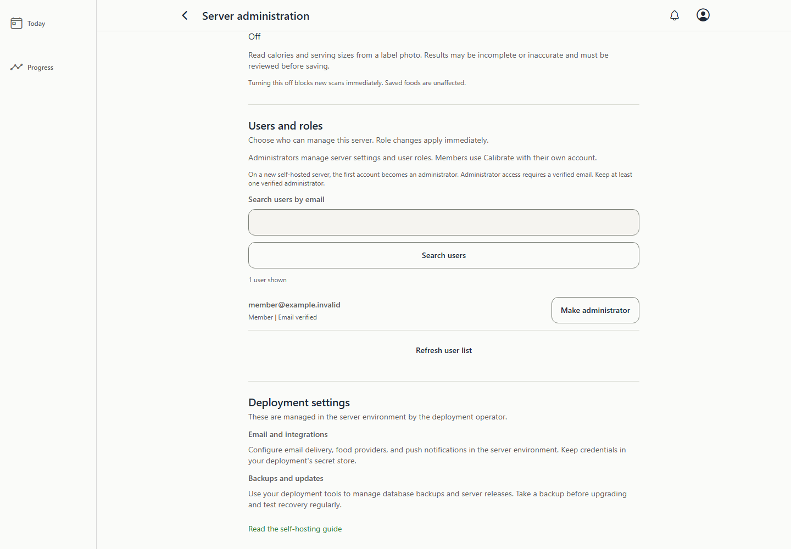](desktop-chrome-users-and-roles.png) |

### Administrator confirmation

| Phone web, 390 x 844 | Desktop web, 1440 x 1000 |
| --- | --- |
| [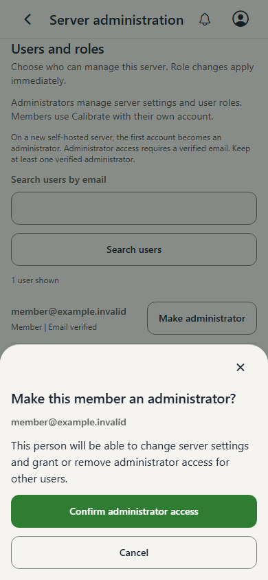](android-phone-chrome-administrator-confirmation.png) | [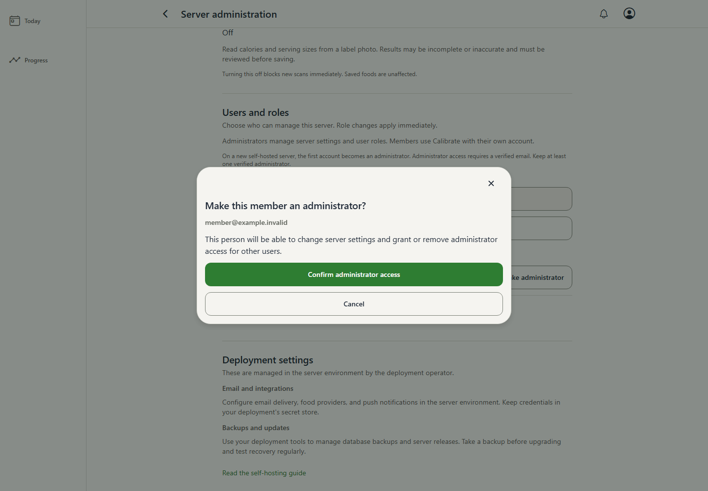](desktop-chrome-administrator-confirmation.png) |

