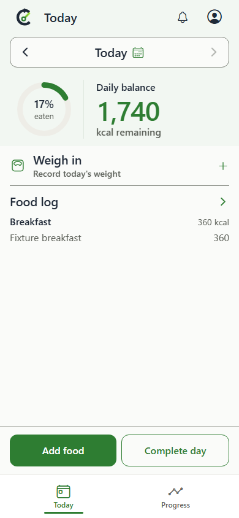
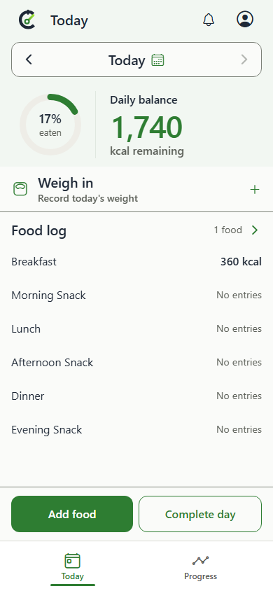
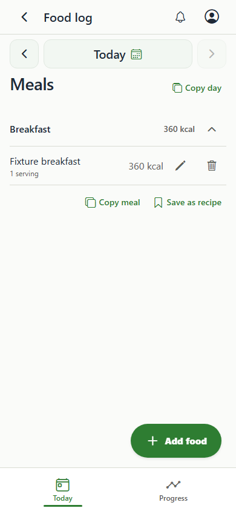
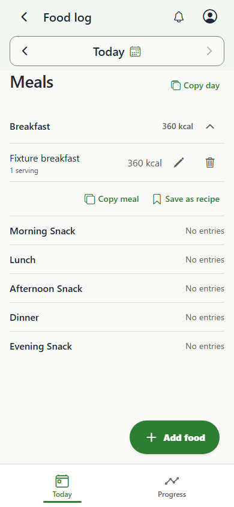
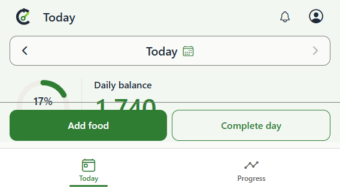
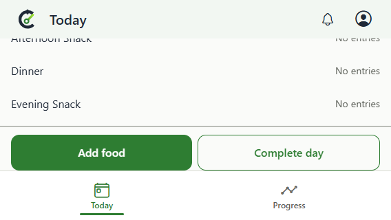

# Meal summary rows and attached date navigation

Today summarizes the six meal periods without individual food items. Empty periods use
neutral "No entries" text; zero-calorie entries still show a logged total. The entire
food pane, including spare height and side gutters, opens the detailed log. Short
screens scroll only the food pane, with the date, daily balance, weight, and action
dock fixed. If enlarged text or the available shell height prevents those regions
and the minimum body from fitting, the page scrolls instead. Food-only scrolling
returns when they fit again, including after rotation back to portrait.

Food log, Activity, and Weight use the same continuous navbar surface and unified date
toolbar as Today, while retaining their route widths and date behavior. The detailed Food log also displays empty meal periods as compact "No entries" rows, including all six periods on an empty day.

| Screen | Before | After |
| --- | --- | --- |
| Today, 390px |  |  |
| Food log, 390px |  |  |

Additional evidence:

- [320px page scrolled to the complete final meal row](today-short-scrolled.png)
- [Tall desktop with spare space inside the food navigation pane](today-tall-desktop.png)
- [Portrait restored after landscape, with only the food pane scrolled](today-portrait-restored.png)

In a 568x320 landscape viewport, the former fixed layout clipped the body. The
height fallback now keeps the weight, every meal, and the bottom actions reachable.
The after capture is scrolled to the final meal and actions.

| Landscape before | Landscape after |
| --- | --- |
|  |  |

Browser regression checks verify the bottom-right blank area navigates to Food log,
all six rows remain reachable at 320px and 200% text, wheel input scrolls only the food pane without moving surrounding controls, and the date toolbar keeps its
vertical position and continuous navbar surface across Today, Food log, Activity,
and Weight. These screenshots use deterministic test data; native device runtime
validation is separate.
