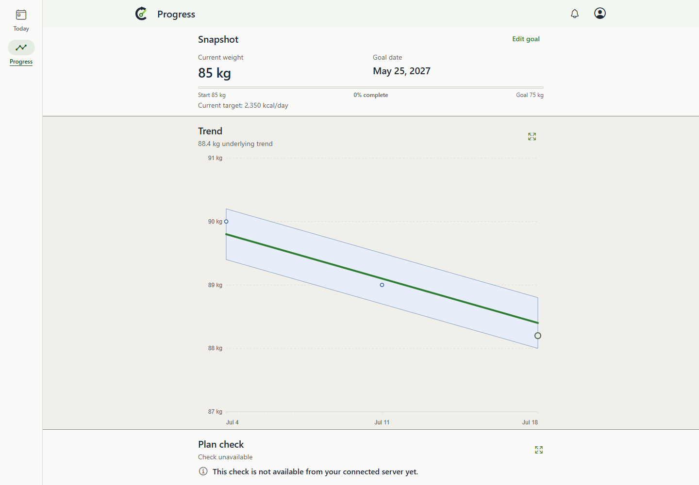
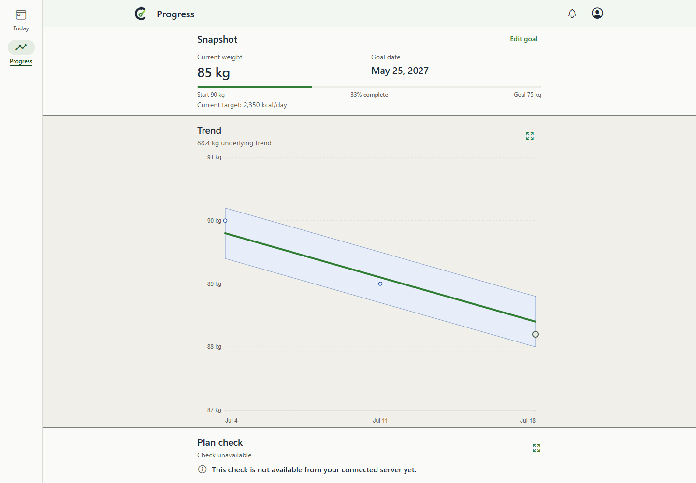

# PR415: bounded desktop rail integration

This is retained validation evidence, not product-branch content or a merge target. Owner: existing issue409/PR415 implementation owner; coordinator retains after handoff. Ref `evidence/pr415-rail-integration-oct05` is kept indefinitely for review/audit, never routinely rewritten/deleted/merged. Retirement requires explicit human authorization.

Before is integrated parent `872f7b5f00c5ace203e1d5c1b15b201c84e9dd48` (master `4728d4f75b70e6440a9778a42cd2224a300db725` plus parent410 `6fadbcc6a6437609ae6e2d49d73ed3da95a94b47`). After is validation source `add21da1fc1993b5ad6ce146ac7696f1132a63df`, exact combined tree `38c0efd6753331d915ef770a69e109c2746d69d8`, adding unchanged feature head `01d4cedf7634007fabdfa829be8b12a47eec2a04`. The feature and parent branches were not modified.

## Observed outcome

| Before: replacement goal | After: retained goal |
| --- | --- |
|  |  |

Actual Windows Chrome154 production exports, synthetic goal7/90kg start/85kg current/75kg target, selecting250 from500kcal/day. Both show2350target and the new forward date; Before resets to85kg/0%, After retains90kg/33% and January1 start. Both have the current88px rail and183px Snapshot. This refresh replaces only desktop current-shell evidence; the old176px-shell originals remain historical.

The [current editor](after-desktop-chrome-light-editor.png) shows original start/date and internal Set a new goal. The [intentional new-goal form](after-desktop-chrome-light-intentional-new-goal.png) uses current85kg. Cancel creates nothing and restores Edit goal focus. [1024px controls](after-desktop-chrome-light-editor-1024.png) remain within the viewport, with no horizontal overflow. Exact state/readback and control bounds are in the two stage JSON files.

Two maintained desktop light/dark cases passed (cancel,503-after-commit retry,manual plan refresh,reopen/reload,history,explicit new-goal save and axe). The matched capture passed once per source and additionally asserted keyboard rail entry, rail return, Escape focus, new-goal cancel focus and1024px controls. No product defect was found. No new native/device/Watch/liveDB check or full backend suite is claimed.

## Reproduce

1. Create separate detached checkouts at the full Before/After source commits above. Run `node .codex/local-environment.setup.mjs`, then `npm.cmd --prefix mobile run build:web` in each. These runs used clean checkouts and fresh exports.
2. Serve each own export with `node scripts/expo-web-static-server.mjs --port PORT` (5199Before,5198After). Compare the exact HTTP bytes for `/progress`, `/today`, `/sw.js` and all six JS files to `builds.json`; all18served hashes matched in this execution.
3. From the After checkout, run `npx.cmd playwright test --config playwright.expo-web.config.ts e2e/expo-web/goal-pace.spec.ts --project=desktop-chrome --workers=2` with `CALIBRATE_EXPO_WEB_BASE_URL=http://127.0.0.1:5198`.
4. Copy the exact evidence-only `e2e/expo-web/goal-pace-integration-capture.spec.ts` from this retained evidence commit into the After checkout. Run it with the same Playwright config, `--project=desktop-chrome --workers=1`, setting `CALIBRATE_EXPO_WEB_BASE_URL` to the respective source server, `CALIBRATE_PACE_COMPARE_STAGE` to before/after, `CALIBRATE_PACE_COMPARE_SOURCE` to the corresponding full source SHA, and `CALIBRATE_PACE_COMPARE_DIR` to a fresh output folder.

The shared fixture freezes July21 2026 19:00UTC, America/Los_Angeles, en-US, reduced motion and scale1. Both use1440x1000/light for the pair; only the After supporting control check resizes to1024x1000. Shared normalization hides unrelated transient PWA notices. No compared content is hidden and no image is cropped or edited.

[Manifest](manifest.json) binds every PNG/readback/build record and exact source or hash of fixtures, harness, config and build/serve scripts. Its identity is also recorded in the PR handoff. Captures were inspected as pixels. Older evidence and QA receipts are preserved; the latest QA verdict and coordinator receipt govern readiness.
